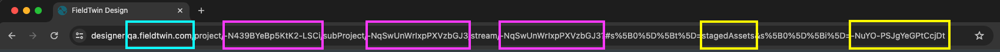
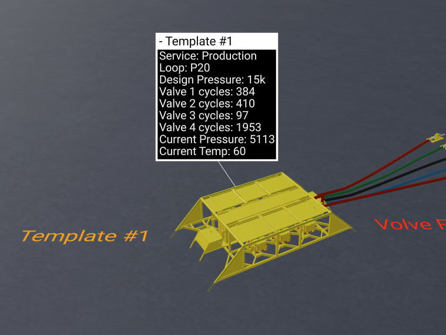
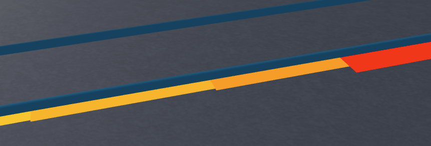
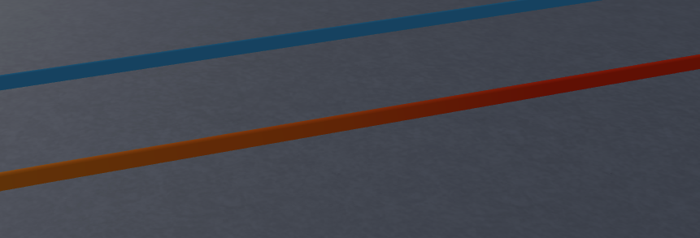
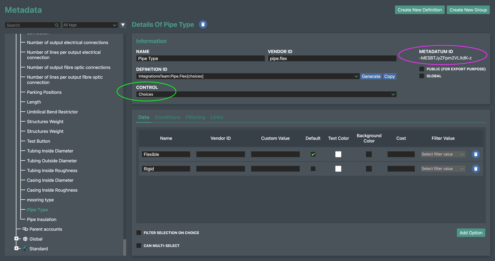
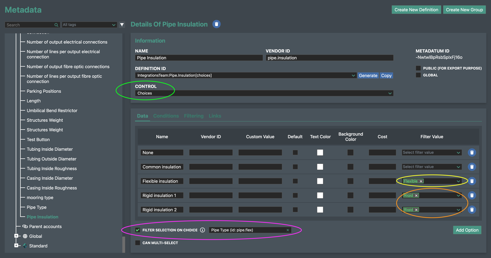
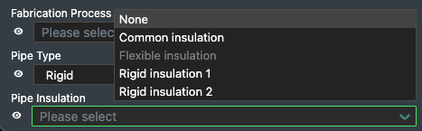

# How to ... with the FieldTwin API

The following examples can be run with the [curl](https://curl.se/) command line
utility or imported into the [Postman](https://www.postman.com/) application
(_File_ menu, _Import_, select _Raw Text_, paste the whole `curl` command, _Continue_,
review and replace the variable placeholders with actual values).

Command line setup for curl commands:

```
export TOKEN=<api token>
export BACKEND_HOST=backend.<your company>.fieldtwin.com
export PROJECT=<project id>
export SUBPROJECT=<subproject id>
export STREAM=<stream id>
```

The API token can be created by an administrator in FieldTwin Admin from the
Account Settings / API section. It must be created for the same account that the
project lives in. API tokens are convenient for testing but they are unrestricted by default,
so once you are familiar with the API you might (depending on your use case) choose to
[use a JWT instead](#provide-a-jwt-instead-of-an-api-token).

The IDs of the project, subproject and stream (and objects below) can be found from
the URL in your browser's address bar when the project is open in FieldTwin Design.
They look like this: `-MeidQjcOmxpYWFIq5zp`.



<br>
<hr>

## Create a manifold

[docs link](https://api.fieldtwin.com/#api-StagedAssets-AddStagedAsset)

```
curl -H "token: ${TOKEN}" \
     -H "content-type: application/json" \
     --request POST \
     --data '{
                "name": "New Manifold #1",
                "asset": "-K5uq-URmQV-aH0-uBpF",
                "tags": [],
                "initialState": {
                    "rotation": 0,
                    "x": 135277.5,
                    "y": 6565034.6,
                    "scale": 1
                },
                "metaData": []
            }' \
     https://${BACKEND_HOST}/API/v1.10/${PROJECT}/subProject/${SUBPROJECT}:${STREAM}/stagedAsset
```

* Asset ID `-K5uq-URmQV-aH0-uBpF` equates to a Manifold in FutureOn's standard asset library
  * The list of available assets can be found by calling `/API/v1.10/assets`
* Coordinate values are provided inside the bounds and in the unit of the
  [Coordinate Reference System](https://design.fieldtwin.com/dashboard/#project-settings)
  defined for the project
  * For example meters for [EPSG:23031](https://epsg.io/23031) or us-feet for [EPSG:3452](https://epsg.io/3452)
* For subsea assets the `z` value is automatically set from the bathymetry if uploaded,
  or else the seabed level defined for the project
* `z` values in FieldTwin are `0` at sea level, negative below sea level and positive
  above sea level

<br>
<hr>

## Create a connection

[docs link](https://api.fieldtwin.com/#api-Connections-AddConnection)

### A draggable connection that follows the bathymetry in FieldTwin

```
curl -H "token: ${TOKEN}" \
     -H "content-type: application/json" \
     --request POST \
     --data '{
               "params": {
                    "type": 2,
                    "label": "API connection"
               },
               "from": "-M8RhZWomNyqNyVgDxpy",
               "fromSocket": "a",
               "to": "-M8RhZWomNyqNyVgDxpm",
               "toSocket": "a",
               "designType": "None",
               "intermediaryPoints": [
                    { "x": 650, "y": 160, "z": -100 },
                    { "x": 795, "y": 20, "z": -100 }
               ]
             }' \
     https://${BACKEND_HOST}/API/v1.10/${PROJECT}/subProject/${SUBPROJECT}:${STREAM}/connection
```

* `params.type` of `2` is the connection type ID for _Oil Production_
* `from` and `fromSocket` are the ID of an existing staged asset and the name of the socket to
  start the connection at
* `to` and `toSocket` indicate the staged asset and location to end the connection at
  * The available socket names can be found from a staged asset's `sockets2d` attribute
* `designType` of `None` indicates that the connection has no special geometry
  (as opposed to a lazy wave riser or a spool for example)
* `intermediaryPoints` defines 2 midpoints that the connection will pass through
  * These will be shown as drag handles in FieldTwin that can be moved to adjust the connection
* If `designType` is not specified it defaults to `Imported`, which creates a different kind
  of connection (see next example)

### A connection based on survey data

```
curl -H "token: ${TOKEN}" \
     -H "content-type: application/json" \
     --request POST \
     --data '{
               "params": {
                    "type": 2,
                    "label": "API connection"
               },
               "from": "-M8RhZWomNyqNyVgDxpy",
               "fromSocket": "a",
               "to": "-M8RhZWomNyqNyVgDxpm",
               "toSocket": "a",
               "designType": "Imported",
               "intermediaryPoints": [
                    { "x": 782, "y": 303, "z": -20 },
                    { "x": 830, "y": 240, "z": -100 },
                    { "x": 920, "y": 170, "z": -50 }
               ],
               "noHeightSampling": true,
               "bendable": false,
               "isLocked": true
             }' \
     https://${BACKEND_HOST}/API/v1.10/${PROJECT}/subProject/${SUBPROJECT}:${STREAM}/connection
```

* The first few parameters are the same as described above
* `designType` of `Imported` indicates that the `intermediaryPoints` are to be treated
  as the complete 3D profile of the connection
  * In reality the `intermediaryPoints` array will be much larger, with smaller changes between points
  * The `xyz` points must be in the same Coordinate Reference System as the project
  * FieldTwin does not show drag handles for `Imported` points
* `noHeightSampling` instructs that the given `z` points should be preserved instead of
  fitting the connection to the bathymetry in FieldTwin
* `isLocked` as `true` prevents a user from accidentally adjusting the connection

<br>
<hr>

## Delete a staged asset

[docs link](https://api.fieldtwin.com/#api-StagedAssets-DeleteStagedAsset)

```
export STAGEDASSET=<staged asset id>

curl -H "token: ${TOKEN}" \
     --request DELETE \
     https://${BACKEND_HOST}/API/v1.10/${PROJECT}/subProject/${SUBPROJECT}:${STREAM}/stagedAsset/${STAGEDASSET}
```

<br>
<hr>

## Get a 3D well bore profile

[docs link](https://api.fieldtwin.com/#api-Wells-GetWell)

```
export WELL=<well id>

curl -H "token: ${TOKEN}" \
     https://${BACKEND_HOST}/API/v1.10/${PROJECT}/subProject/${SUBPROJECT}:${STREAM}/well/${WELL}
```

* The bore profile is returned in the `wellBores[0 .. n].path` attribute
* The bore path is empty by default, it can be set or imported from FieldTwin Design,
  or generated with the [Well Assist integration](https://appdocs.fieldtwin.com/wellassist/)

<br>
<hr>

## Get a generated seabed profile for a connection

[docs link](https://api.fieldtwin.com/#api-Connections-GetConnection)

```
export SAMPLE_RESOLUTION=5
export CONNECTION=<connection id>

curl -H "token: ${TOKEN}" \
     -H "sample-every: ${SAMPLE_RESOLUTION}" \
     -H "simplify: true" \
     https://${BACKEND_HOST}/API/v1.10/${PROJECT}/subProject/${SUBPROJECT}:${STREAM}/connection/${CONNECTION}
```

* The value of sample resolution can be `1` or more
* Providing `simplify: true` removes points that fall in a straight line to reduce the data size
* The connection profile is returned in the `sampled` attribute
* The profile points are given in the direction `from` to `to`
* You can also use the [profile-tools](https://github.com/XvisionAS/fieldtwin-open-libraries/tree/main/profile-tools)
  package to extract connection profiles

<br>
<hr>

## Get the profile of an imported connection

[docs link](https://api.fieldtwin.com/#api-Connections-GetConnection)

```
export CONNECTION=<connection id>

curl -H "token: ${TOKEN}" \
     https://${BACKEND_HOST}/API/v1.10/${PROJECT}/subProject/${SUBPROJECT}:${STREAM}/connection/${CONNECTION}
```

* Imported connections (including those created with the API when no other `designType` is given)
  generally have a `designType` of `Imported`
* The imported points are made up from the `fromCoordinate` plus the `intermediaryPoints` plus the `toCoordinate`
* When `noHeightSampling` is true, the point `z` (depth) values are as they were at import time
* When `noHeightSampling` is false, the point `z` (depth) values are sampled from the bathymetry layer
  or else the project seabed depth setting
* You can also use the [profile-tools](https://github.com/XvisionAS/fieldtwin-open-libraries/tree/main/profile-tools)
  package to extract connection profiles

Note: for connections manually created (not imported) in FieldTwin Design, the `intermediaryPoints`
consist of auto-generated points along the connection (when the point has attribute `added: true`)
and/or the locations of the connection's midpoints - shown as circular drag handles in FieldTwin.

<br>
<hr>

## Get and set metadata values

Metadata values are stored in the `metaData` array attribute on objects in the field.
You can see the general data structure by requesting a single connection / staged asset / well / layer / shape:

```
export CONNECTION=<connection id>

curl -H "token: ${TOKEN}" \
     https://${BACKEND_HOST}/API/v1.10/${PROJECT}/subProject/${SUBPROJECT}:${STREAM}/connection/${CONNECTION}
-->
{
     "visible": true,
     "fromSocket": "b",
     "toSocket": "a",
     "params": {
          "type": 4,
          "label": "Water Injection #1",
          "width": 1
     },
     "from": { ... },
     "to": { ... },
     ...
     "metaData": [
          {
               "id": "-NTruDmpGaWmFq5dY1UL",
               "metaDatumId": "-MX1hgyA5rMYnffSIDqS",
               "metaDatumLinkId": "-NTruDmpGaWmFq5dY1UL",
               "definitionId": "IntegrationsTeam:CustomString[string]",
               "name": "Custom String",
               "type": "string",
               "tags": [],
               "value": "my string",
               "cost": 0,
               "costPerLength": false,
               "vendorAttributes": {}
          },
          {
               "id": "-NTruFFZ1QdcHPX7DsWg",
               "metaDatumId": "-MKeJ9PrkJXvPLg9vYzB",
               "metaDatumLinkId": "-NTruFFZ1QdcHPX7DsWg",
               "definitionId": "IntegrationsTeam:KeyPoints[table]",
               "name": "Key Points",
               "type": "table",
               "tags": [],
               "value": [
                    {
                         "-MKeJHF9Q0jyb4AIwicf": "1",
                         "-MKeJIq3E-RffPBFbJdG": "100"
                    },
                    {
                         "-MKeJHF9Q0jyb4AIwicf": "2",
                         "-MKeJIq3E-RffPBFbJdG": "200"
                    }
               ],
               "cost": 0,
               "costPerLength": false,
               "vendorAttributes": {}
          }
     ]
}
```

:warning: At the time of writing (FieldTwin 7.x), requesting a whole subproject will return
metadata values for the connections, staged assets and shapes but not for wells and layers - 
metadata for these must be fetched with separate API calls.

To add or change the metadata values for an object, `PATCH` the object by sending the
`metaData` array with only the metadata attributes to update. The minimum attributes to
send are the `metaDatumId` (identifying the relevant metadatum definition) and `value`.

The following example updates the 2 metadata values on the connection shown above.

```
export CONNECTION=<connection id>

curl -H "token: ${TOKEN}" \
     -H "content-type: application/json" \
     --request PATCH \
     --data '{
                "metaData": [
                    {
                         "metaDatumId": "-MX1hgyA5rMYnffSIDqS",
                         "value": "Flexible"
                    },
                    {
                         "metaDatumId": "-MKeJ9PrkJXvPLg9vYzB",
                         "value": []
                    }
                ]
             }' \
     https://${BACKEND_HOST}/API/v1.10/${PROJECT}/subProject/${SUBPROJECT}:${STREAM}/connection/${CONNECTION}
```

:warning: When a metadatum value has been cleared or has not been set, the `value` attribute
will be missing from the metadatum object. In your code be sure to check that `value` exists
before reading from it. The data type and content of `value` varies depending on the
metadatum's `type`. The following types are supported:

### string

To set a string, provide a string in `value`:

```
PATCH object
<--
{ "metaData": [{
     "metaDatumId": "-MHm9G9TaN4W_4jMYPHl",
     "value": "value as a string"
}]}
```

### numerical and slider

To set a numerical, provide an integer or a floating point number in `value`.
To set the unit (if applicable), specify the unit in the `option` attribute
(for example `mm`, `ft3`, `C`, `sm3/m3`, `W/m2/C`):

```
PATCH object
<--
{ "metaData": [{
     "metaDatumId": "-MHm9G9TaN4W_4jMYPHl",
     "value": 150.1,
     "option": "m"
}]}
```

### boolean

To set a boolean, provide the string `true` or `false` in `value`:

```
PATCH object
<--
{ "metaData": [{
     "metaDatumId": "-MHm9G9TaN4W_4jMYPHl",
     "value": "true"
}]}
```

Depending on your use case, if the `value` attribute is missing (meaning that no
value has been saved) you may want to treat this as `false`.

### choices - single selection

Use [Request all metadata definitions](https://api.fieldtwin.com/#api-MetadataDefinitions-GetMetaDataDefinitions)
or [Request one metadata definition](https://api.fieldtwin.com/#api-MetadataDefinitions-GetMetaDataDefinition)
with the `metaDatumId` to fetch the metadatum definition and its list of possible choices.

Each choice is its own separate object with attributes for: `id`, `name`, and optionally
a `customValue`. The name is what is displayed in the user interface, and the custom value
(if present) is the value to use for the choice instead of its name.

When reading metadata, the `value` will be the selected choice object. For example:

```
GET object
-->
"metaData": [
     {
          "id": "-NTsQ5XGQctE7dDV5OrH",
          "metaDatumId": "-MX1hgyA5rMYnffSIDqS",
          "metaDatumLinkId": "-NTsQ5XGQctE7dDV5OrH",
          "definitionId": "MyAccount:NumberOfSlots[choices]",
          "name": "Number of slots",
          "type": "choices",
          "tags": [],
          "value": {
               "id": "-NTt33VQYMf-LD6VKZzR",
               "name": "6 Slot",
               "customValue": "6",
               "filterValue": []
          },
          "cost": 0,
          "costPerLength": false,
          "vendorAttributes": {}
     }
]
```

So the final metadata value to use here is `6`, or it would be `6 Slot` if there was
no `customValue`.

To set a choice, provide one of the choice objects in `value`.
You can provide just the `id` of the choice object if you prefer:

```
PATCH object
<--
{ "metaData": [{
     "metaDatumId": "-MX1hgyA5rMYnffSIDqS",
     "value": { "id": "-NTt33VQYMf-LD6VKZzR" }
}]}
```

### choices - multiple selection

This case is similar to _choices - single selection_, but the `value` is now an array
of choice objects. To clear all choices, apply a zero length array:

```
PATCH object
<--
{ "metaData": [{
     "metaDatumId": "-MX1hgyA5rMYnffSIDqS",
     "value": []
}]}
```

Or to select 2 choices:

```
PATCH object
<--
{ "metaData": [{
     "metaDatumId": "-MX1hgyA5rMYnffSIDqS",
     "value": [
          { "id": "-NTt33VQYMf-LD6VKZzR" },
          { "id": "-NTt34S9xlSnOcx-FAhy" }
     ]
}]}
```

### asset

A type of asset allows for the selection of an asset from the asset library or a
virtual asset defined in FieldTwin Admin. All metadata values associated with the
selected asset will then be presented in FieldTwin and nested inside this metadatum
object in a new `subValue` attribute.

The `value` to store in the metadatum object is the ID of the asset definition
or the virtual asset. Request the list of allowable IDs using
[Request the list of asset definitions](https://api.fieldtwin.com/#api-Assets-GetAssets).

To set an asset and create the nested `subValue` containing that asset's metadata,
provide the asset ID as a string in `value`:

```
PATCH object
<--
{ "metaData": [{
     "metaDatumId": "-MHm9G9TaN4W_4jMYPHl",
     "value": "-M3LRYZGl2h0K902juxA"
}]}
```

### connection

A type of connection allows for the selection of a connection type. All metadata
values associated with the selected connection type will then be presented in FieldTwin
and nested inside this metadatum object in a new `subValue` attribute.

The `value` to store in the metadatum object is the ID of the connection type.
Request the list of allowable IDs using
[Request the list of connection definitions](https://api.fieldtwin.com/#api-Accounts-GetAccountConnections).

To set a connection type and create the nested `subValue` containing that connection's metadata,
provide the definition ID in `value`:

```
PATCH object
<--
{ "metaData": [{
     "metaDatumId": "-MHm9G9TaN4W_4jMYPHl",
     "value": 4
}]}
```

:warning: At the time of writing (FieldTwin 7.x) the pre-installed connection types
have a numeric ID while custom connection types have a string ID.

### table

Use [Request all metadata definitions](https://api.fieldtwin.com/#api-MetadataDefinitions-GetMetaDataDefinitions)
or [Request one metadata definition](https://api.fieldtwin.com/#api-MetadataDefinitions-GetMetaDataDefinition)
with the `metaDatumId` to fetch the metadatum definition and its list of table headers.

Each table header / column in the definition has an `id` and `name`.

The metadatum `value` is an array of rows, where each row is a key/value object with
the column ID as its key.

To set a 2x2 table, provide the following array in `value`:

```
PATCH object
<--
{ "metaData": [{
     "metaDatumId": "-MHm9G9TaN4W_4jMYPHl",
     "value": [
          {
               "id-of-column-1": "col A row 1",
               "id-of-column-2": "col B row 1"
          },
          {
               "id-of-column-1": "col A row 2",
               "id-of-column-2": "col B row 2"
          }
     ]
}]}
```

### button

Button metadata shows a button on the user interface that launches a web page when clicked.
It does not have a `value` and setting one has no effect.

<br>
<hr>

## Visualise custom data for a staged asset

[docs link](https://api.fieldtwin.com/#api-StagedAssets-SetStagedAsset)

Custom results are names and values displayed in a box next to the staged asset in
FieldTwin Design. They can be used for displaying simulation results or operational
data.

```
export STAGEDASSET=<staged asset id>

curl -H "token: ${TOKEN}" \
     -H "content-type: application/json" \
     --request PATCH \
     --data '{
                "customResults": {
                    "Current": [
                        {"name": "Service", "value": "Production", "type": "string"},
                        {"name": "Valve 1 cycles", "value": 384, "type": "decimal"},
                        {"name": "Valve 2 cycles", "value": 410, "type": "decimal"},
                        {"name": "Current Pressure", "value": 5113, "type": "decimal"},
                        {"name": "Current Temp", "value": 60, "type": "decimal"}
                    ]
                },
                "showCustomResults": true
            }' \
     https://${BACKEND_HOST}/API/v1.10/${PROJECT}/subProject/${SUBPROJECT}:${STREAM}/stagedAsset/${STAGEDASSET}
```



To hide the custom results in FieldTwin Design:

```
curl -H "token: ${TOKEN}" \
     -H "content-type: application/json" \
     --request PATCH \
     --data '{ "showCustomResults": false }' \
     https://${BACKEND_HOST}/API/v1.10/${PROJECT}/subProject/${SUBPROJECT}:${STREAM}/stagedAsset/${STAGEDASSET}
```

<br>
<hr>

## Visualise custom data along a connection

[docs link](https://api.fieldtwin.com/#api-Connections-SetConnection)

Connection visualisation data is displayed at key points on or alongside a connection
in FieldTwin Design. This can be used for displaying simulation results, survey results
or operational data.

```
export CONNECTION=<connection id>

curl -H "token: ${TOKEN}" \
     -H "content-type: application/json" \
     --request PATCH \
     --data '{
                "visualisationMaps": [{
                    "id": "connection-1-custom-temp",
                    "name": "Temperature Survey",
                    "normalizedKp": false,
                    "rendering": "bar",
                    "data": [
                        {"kp": 100, "v": 68},
                        {"kp": 200, "v": 67},
                        {"kp": 300, "v": 66},
                        {"kp": 400, "v": 65},
                        {"kp": 500, "v": 64}
                    ]
                }],
                "visibleVisualisationMapId": "connection-1-custom-temp"
            }' \
     https://${BACKEND_HOST}/API/v1.10/${PROJECT}/subProject/${SUBPROJECT}:${STREAM}/connection/${CONNECTION}
```

* The visualisation data is provided as an array of key points `kp` as a distance
  along the connection and a corresponding numeric value `v`
* When `normalizedKp` is true, the key point `kp` is a value between `0` and `1`
  instead of a value in feet/meters (so `0.5` would be half way along the connection)
* A rendering of:
  * `bar` displays the visualisation alongside the connection
  * `on-connection` displays the visualisation inside the connection
  * See the documentation for other possible values
* A palette for the visualisation can also be provided, but a default palette is
  generated by default





To hide the visualisation in FieldTwin Design:

```
curl -H "token: ${TOKEN}" \
     -H "content-type: application/json" \
     --request PATCH \
     --data '{ "visibleVisualisationMapId": null }' \
     https://${BACKEND_HOST}/API/v1.10/${PROJECT}/subProject/${SUBPROJECT}:${STREAM}/connection/${CONNECTION}
```

<br>
<hr>

## Store custom data at project level

[docs link (write)](https://api.fieldtwin.com/#api-Projects-PatchProject)  
[docs link (read)](https://api.fieldtwin.com/#api-Projects-GetProjectVendorAttributes)

FieldTwin provides the `vendorAttributes` attribute on many objects including account,
project, subproject, staged asset, connection, and document. This can be used to attach
custom data to the object. There is no built-in visualisation of this data.

Because `vendorAttributes` can be used by more than one integration or for more than one
purpose, we use a convention of storing data objects inside a child key to keep the different
uses separate. The API will merge the provided top-level key(s) into the `vendorAttributes`
without overwriting other existing top-level keys.

```
curl -H "token: ${TOKEN}" \
     -H "content-type: application/json" \
     --request PATCH \
     --data '{ "vendorAttributes": { "myIntegration": { "foo": "bar" } } }' \
     https://${BACKEND_HOST}/API/v1.10/${PROJECT}
```

Example of data separation using keys:

```
curl -H "token: ${TOKEN}" \
     -H "content-type: application/json" \
     --request PATCH \
     --data '{ "vendorAttributes": { "drillPro": { "settings": { "name": "Drill Pro v1" } } } }' \
     https://${BACKEND_HOST}/API/v1.10/${PROJECT}

curl -H "token: ${TOKEN}" \
     -H "content-type: application/json" \
     --request PATCH \
     --data '{ "vendorAttributes": { "heatCalc": { "scenario": "Base Case", "autoCalc": true, "pipes": ["c-1", "c-2", "c-3"] } } }' \
     https://${BACKEND_HOST}/API/v1.10/${PROJECT}

curl -H "token: ${TOKEN}" \
     https://${BACKEND_HOST}/API/v1.10/${PROJECT}/vendorAttributes
-->
     {
          "drillPro": {
               "settings": {
                    "name": "Drill Pro v1"
               }
          },
          "heatCalc": {
               "scenario": "Base Case",
               "autoCalc": true,
               "pipes": ["c-1", "c-2", "c-3"]
          }
     }
```

* Only one level of keys is merged into `vendorAttributes`
     * In the above example, to add something new into `drillPro` you have to PATCH
       the whole `drillPro` object a second time
* To delete one set of `vendorAttributes`,
  send PATCH data of the format: `{ "vendorAttributes": { "myIntegration": null } }`

<br>
<hr>

## Request linked (parent/child) subprojects

[docs link](https://design.fieldtwin.com/dashboard/#links)

By default, requesting a child subproject returns the sum of objects from both the parent
subproject(s) and the child. Objects that are automatically merged from a parent subproject
have a different `subProject` value and are given additional attributes in the JSON:

```
curl -H "token: ${TOKEN}" \
     https://${BACKEND_HOST}/API/v1.10/${PROJECT}/subProject/${SUBPROJECT}:${STREAM}
-->
{
     "id": "-MjF6TYxJ-mkAzWnnsfa",
     "name": "Child Subproject",
     "stagedAssets": {
          "-MkaNgEfqAYhqyhQHNsz": {
               "name": "Local FPSO #1",
               "visible": true,
               "subProject": "-MjF6TYxJ-mkAzWnnsfa"
          },
          "-MjF4vtXQ574Bid3Zbs2": {
               "name": "XMT from parent backdrop",
               "visible": true,
               "subProject": "-MjF3wciX_dTQzLL4aOu",
               "project": "-MjF3L9vJdSXSOiYZiMQ",
               "isForeign": true,
               "getFromSubProject": "https://example.fieldtwin.com/API/v1.10/-MjF3L9vJdSXSOiYZiMQ/subProject/-MjF3wciX_dTQzLL4aOu",
               "getFrom": "https://example.fieldtwin.com/API/v1.10/-MjF3L9vJdSXSOiYZiMQ/subProject/-MjF3wciX_dTQzLL4aOu/stagedAsset/-MjF4vtXQ574Bid3Zbs2"
          }
     }
}
```

If you wish to request a child subproject without merging the items from the parent(s),
set the `merge-foreign` request header to `false`. The parent objects are then returned
in a separate list of `foreignSubProjects`.

```
curl -H "token: ${TOKEN}" \
     -H "merge-foreign: false" \
     https://${BACKEND_HOST}/API/v1.10/${PROJECT}/subProject/${SUBPROJECT}:${STREAM}
-->
{
     "id": "-MjF6TYxJ-mkAzWnnsfa",
     "name": "Child Subproject",
     "stagedAssets": {
          "-MkaNgEfqAYhqyhQHNsz": {
               "name": "Local FPSO #1",
               "visible": true,
               "subProject": "-MjF6TYxJ-mkAzWnnsfa"
          }
     },
     "foreignSubProjects": [
          {
               "id": "-MjF3wciX_dTQzLL4aOu",
               "name": "Parent Project 1",
               "stagedAssets": {
                    "-MjF4vtXQ574Bid3Zbs2": {
                         "name": "XMT from parent backdrop",
                         "visible": true,
                         "subProject": "-MjF3wciX_dTQzLL4aOu",
                         "project": "-MjF3L9vJdSXSOiYZiMQ",
                         "isForeign": true
                    }
               }
          }
     ]
}
```

Requesting a parent subproject returns only the objects that live in the parent.

<br>
<hr>

## Use Smart Models

[docs link](https://design.fieldtwin.com/Releasenotes/#smart-models)

Smart 3D models consist of special 3D assets that can be combined together as components
to create a customized staged asset. The customizations are controlled by setting special
metadata attributes.

To use smart models, ask FutureOn to deploy the required smart assets and associated
metadata definitions into your Asset Library.

When a staged asset is created from a smart model in FieldTwin, its "docking slots" will
be made available as metadata values with `"type": "asset"`.

### Wind turbine smart models (2024 onwards)

Configurable Wind smart models are included in FutureOn's standard asset library as of 2024.
The workflow for creation of a turbine is:

1. Create a _WindTool Construction Base_ staged asset
2. Set its metadata value for _turbine_ to one of the allowed turbine assets
3. Set its metadata value for _foundation_ to one of the allowed foundation assets

Following step 1 the resulting data can be retrieved as follows:

```
export STAGEDASSET=<staged asset id>

curl -H "token: ${TOKEN}" \
     https://${BACKEND_HOST}/API/v1.10/${PROJECT}/subProject/${SUBPROJECT}:${STREAM}/stagedAsset/${STAGEDASSET}
-->
{
     "id": "-NtWdCF0msKLrkbwhSgN",
     "name": "WindTool Construction Base #1",
     "visible": true,
     "virtual": false,
     ...
     "metaData": [
          {
               "metaDatumId": "-NtWDOfryzi8OEwdm7I9",
               "definitionId": "WindPOC:5MWWT[asset]",
               "name": "5MW WT",
               "type": "asset",
               "tags": [],
               "cost": 0,
               "metaDatumLinkId": "-NtWDrplqhtzDTrqM7Z4",
               "id": "-NtWDrplqhtzDTrqM7Z4",
               "subValue": []
          },
          {
               "metaDatumId": "-Nky37U2lazdWHzMXQAs",
               "definitionId": "WindPOC:5MWFoundations[asset]",
               "name": "5MW Foundations",
               "type": "asset",
               "tags": [],
               "cost": 0,
               "metaDatumLinkId": "-NtWP2c3UY_EwEOP-Ymq",
               "id": "-NtWP2c3UY_EwEOP-Ymq",
               "subValue": []
          }
     ],
     "sockets2d": []
}
```

After fetching the newly created _Construction Base_, two metadata objects are returned:
one for the wind turbine (WT) and the other for the turbine foundation. Neither has a `value`
attribute in the `metaData` object - the docking slots are empty. To set them we need to set
the `value` to the ID of an allowable asset from the asset library (note: use the ID of an asset
definition, not a staged asset in the project):

```
curl -H "token: ${TOKEN}" \
     -H "content-type: application/json" \
     --request PATCH \
     --data '{
                "metaData": [{
                    "metaDatumId": "-NtWDOfryzi8OEwdm7I9",
                    "value": "-N4R5TPAOGih17IYVZm3"
                }, {
                    "metaDatumId": "-Nky37U2lazdWHzMXQAs",
                    "value": "-N4RytdCUlxy8oJSdDIv"
                }]
            }' \
     https://${BACKEND_HOST}/API/v1.10/${PROJECT}/subProject/${SUBPROJECT}:${STREAM}/stagedAsset/${STAGEDASSET}
```

The above call will set both a turbine body and a foundation in the base's docking slots.

To find the allowable asset IDs for a docking slot, first request the metadata definition
using the metadata definition ID in `metaDatumId`:

```
curl -H "token: ${TOKEN}" \
     https://${BACKEND_HOST}/API/v1.10/metadatadefinitions/-Nky37U2lazdWHzMXQAs
-->
{
     "id": "-Nky37U2lazdWHzMXQAs",
     "name": "5MW Foundations",
     "definitionId": "WindPOC:5MWFoundations[asset]",
     "cost": 0,
     "order": 200000,
     "global": true,
     "public": false,
     "options": {
          "unit": {},
          "filter": {
               "assetTypes": ["vessel"],
               "assetSubTypes": ["WindTurbine"],
               "assetCategories": ["Wind"],
               "assetSubCategories": ["5MW Floater", "5MW Jacket", "5MW MonoPile"]
          },
          "docking": {}
     },
     "standard": true,
     "clonedFroms": ["-Nky37U2lazdWHzMXQAs"],
     "displayIfConditions": [],
     "type": "asset"
}
```

Then use the filters given in `options.filter` to find asset definitions in the asset
library that match the filters:

```
curl -H "token: ${TOKEN}" \
     https://${BACKEND_HOST}/API/v1.10/assets
-->
{
     ...
     "-N4R5mVs3w46MbHGqByC": {
          "id": "-N4R5mVs3w46MbHGqByC",
          "name": "5MW Floater",
          "params": {...},
          "shared": true,
          "type": "vessel",                      // match on filter.assetTypes
          "subType": "WindTurbine",              // match on filter.assetSubTypes
          "category": "Wind",                    // match on filter.assetCategories
          "subCategory": "5MW Floater",          // match on filter.assetSubCategories
          "imageUrl": "...",
          "sockets2d": [...],
          "model3dUrl": "...",
          "dockingMales": [],
          "dockingFemale": {...},
          "filename2D": "5MW_Floater.png - Tue, 20 Feb 2024 12:03:19 GMT",
          "filename3D": "5MW_Floater180.glb - Tue, 20 Feb 2024 11:50:32 GMT",
          "filenameSockets": "5MW_Floater180.sockets - Tue, 20 Feb 2024 11:55:09 GMT",
          "hideInAssetLibrary": true
     },
     "-N4RytdCUlxy8oJSdDIv": {
          "id": "-N4RytdCUlxy8oJSdDIv",
          "name": "5MW Jacket",
          "params": {...},
          "shared": true,
          "type": "vessel",                      // match on filter.assetTypes
          "subType": "WindTurbine",              // match on filter.assetSubTypes
          "category": "Wind",                    // match on filter.assetCategories
          "subCategory": "5MW Jacket",           // match on filter.assetSubCategories
          "imageUrl": "...",
          "sockets2d": [],
          "model3dUrl": "...",
          "dockingMales": [],
          "dockingFemale": {...},
          "filename2D": "5MW_Jacket.png - Mon, 13 Jun 2022 12:10:47 GMT",
          "filename3D": "5MW_Jacket.glb - Mon, 13 Jun 2022 12:01:57 GMT",
          "filenameSockets": "5MW_Jacket.sockets - Mon, 13 Jun 2022 12:11:05 GMT",
          "hideInAssetLibrary": true
     },
     "-N4Rz5E2U88Qoq02TLF2": {
          "id": "-N4Rz5E2U88Qoq02TLF2",
          "name": "5MW MonoPile",
          "params": {...},
          "shared": true,
          "type": "vessel",                      // match on filter.assetTypes
          "subType": "WindTurbine",              // match on filter.assetSubTypes
          "category": "Wind",                    // match on filter.assetCategories
          "subCategory": "5MW MonoPile",         // match on filter.assetSubCategories
          "imageUrl": "...",
          "sockets2d": [],
          "model3dUrl": "...",
          "dockingMales": [],
          "dockingFemale": {...},
          "filename2D": "5MW_MonoPile.png - Mon, 13 Jun 2022 12:09:44 GMT",
          "filename3D": "5MW_MonoPile.glb - Wed, 22 Jun 2022 11:24:37 GMT",
          "filenameSockets": "5MW_MonoPile.sockets - Wed, 22 Jun 2022 11:28:23 GMT",
          "hideInAssetLibrary": true
     },
     ...
}
```

In this example the allowable values for the `5MW Foundations` docking slot in the
parent staged asset are:

* `-N4R5mVs3w46MbHGqByC` to create a `5MW Floater` foundation in the slot, or
* `-N4RytdCUlxy8oJSdDIv` to create a `5MW Jacket` foundation, or
* `-N4Rz5E2U88Qoq02TLF2` to create a `5MW MonoPile` foundation, or
* `null` to set the docking slot as empty

### Connecting a connection to a docking slot

Most assets in FutureOn's asset library define one or more "sockets" that allow a connection
to be connected to it. Assets that make up the swappable components of a smart model may also
define sockets.

In the example of how to [create a connection](#create-a-connection) you can see that
a connection is attached **to** a regular staged asset by settings these attributes:

```
{
  "to": "<id of a staged asset>",
  "toSocket": "<name of a socket in stagedAsset.sockets2d>"
}
```

However the item in a docking slot of a smart model is not a staged asset, it exists
only as a metadata value. To connect a connection to an item in a docking slot we have
to set the connection's `to` and `toSocket` differently.

In the previous smart model example, after creating the _Construction Base_ and assigning
a wind turbine body in its docking slot, the staged asset is the _Construction Base_ and
its data is as follows:

```
export STAGEDASSET=<staged asset id>

curl -H "token: ${TOKEN}" \
     https://${BACKEND_HOST}/API/v1.10/${PROJECT}/subProject/${SUBPROJECT}:${STREAM}/stagedAsset/${STAGEDASSET}
-->
{
     "id": "-NtWdCF0msKLrkbwhSgN",
     "name": "WindTool Construction Base #1",
     "visible": true,
     "virtual": false,
     ...
     "metaData": [
          {
               "metaDatumId": "-NtWDOfryzi8OEwdm7I9",
               "definitionId": "WindPOC:5MWWT[asset]",
               "name": "5MW WT",
               "type": "asset",
               "tags": [],
               "cost": 0,
               "value": "-N4R5TPAOGih17IYVZm3",
               "metaDatumLinkId": "-NtWDrplqhtzDTrqM7Z4",
               "id": "-NtWDrplqhtzDTrqM7Z4",
               "subType": "WindTurbine",
               "category": "Wind",
               "subCategory": "5MW WT",
               "subValue": [
                    ... nested metadata for the wind turbine ...
               ]
          },
          {
               ... metadata that sets the foundation ...
          }
     ],
     "sockets2d": [
          {
               "x": 1.958685174628093,
               "y": 1.1513813644766508,
               "z": -3.017566015066542,
               "name": "-NuZOI2drjETshKe6zQw:001",
               "generated": true,
               "assetId": "-N4R5TPAOGih17IYVZm3",
               "radius": 0.25,
               "metaData": []
          },
          {
               "x": -1.974785545371426,
               "y": 1.1513827399763774,
               "z": -3.017567390566267,
               "name": "-NuZOI2drjETshKe6zQw:002",
               "generated": true,
               "assetId": "-N4R5TPAOGih17IYVZm3",
               "radius": 0.25,
               "metaData": []
          }
     ]
}
```

Since `5MW WT` was assigned in the `metaData` the base staged asset has gained 2 entries
in its `sockets2d` attribute, both marked as `"generated": true`. These 2 sockets are defined
on the turbine body asset (indicated by `"assetId": "-N4R5TPAOGih17IYVZm3"`) and they have
now been inherited by the parent staged asset and given a generated name.

To connect an existing mooring line to the turbine body in the docking slot, update the
mooring line, setting `to` as the base staged asset's ID and `toSocket` as one of the
generated socket names.

```
export CONNECTION=<mooring line id>

curl -H "token: ${TOKEN}" \
     -H "content-type: application/json" \
     --request PATCH \
     --data '{
                 "to": "-NtWdCF0msKLrkbwhSgN",
                 "toSocket": "-NuZOI2drjETshKe6zQw:001"
             }' \
     https://${BACKEND_HOST}/API/v1.10/${PROJECT}/subProject/${SUBPROJECT}:${STREAM}/connection/${CONNECTION}
```

To connect the connection in the opposite direction, set `from` and `fromSocket`.

<br>
<hr>

## Create a metadata definition with variable choices

Sometimes a metadata attribute defined as a 'list of choices' needs to present different options
depending on context:

```
- Choice A (always relevant)
- Choice B (relevant only for some use cases)
- Choice C (relevant only for different use cases)
- ...
```

One way to achieve this is to create 2 or more definitions, each with a different list of choices.
Metadata conditions can then be defined to show or hide the appropriate definition so that only one
is visible at a time. This is appropriate if it is correct for the definition ID and selected choice
to be separate for each use case.

If what is needed is a single definition, common to all use cases, we instead need to vary the list
of allowed choices at runtime. This can be set up in FieldTwin Admin as long as the context can be
determined from another metadata attribute.

Firstly a metadata definition is needed to provide the context or use case. It needs to be of type
`choices`. This example will determine whether a pipe is `Rigid` or `Flexible`:



Then when defining a list of choices elsewhere we can use that context to determine which choices
are made available to the user:



The same configuration can be created with the API.

From the "context" definition the data required are its `id` and the `id` of its choices
(found in `options.items.list[].id`).

```
export CONTEXT_METADATA_DEFINITION_ID=<metadatum id>

curl -H "token: ${TOKEN}" \
     https://${BACKEND_HOST}/API/v1.10/metadatadefinitions/${CONTEXT_METADATA_DEFINITION_ID}
-->
     {
          "id": "-MESBTJyZFpm2VLXdK-z",
          "account": "-MIyPbG_cjUjO7E3ZgzZ",
          "name": "Pipe Type",
          "type": "choices",
          "tags": [],
          "global": false,
          "public": false,
          "shouldFilterChoices": false,
          "options": {
               "items": {
                    "list": [
                         { "id": "-NwxOrTr5fTh95O5vQl5", "name": "Flexible", "filterValue": [] },
                         { "id": "-NwxOtAL47e_Q52uFnWU", "name": "Rigid",    "filterValue": [] }
                    ],
                    "default": { "id": "-NwxOrTr5fTh95O5vQl5", "name": "Flexible", "filterValue": [] }
               }
          },
          "vendorId": "pipe.flex",
          "definitionId": "IntegrationsTeam:Pipe.Flex[choices]"
     }
```

The variable list of choices is created using the API as follows:

```
curl -H "token: ${TOKEN}" \
     -H "content-type: application/json" \
     --request POST \
     --data '{
               "name": "Pipe Insulation",
               "type": "choices",
               "global": false,
               "public": false,
               "vendorId": "pipe.insulation",
               "shouldFilterChoices": true,
               "filterIf": "-MESBTJyZFpm2VLXdK-z",
               "options": {
                    "items": {
                         "list": [
                              {
                                   "name": "None",
                                   "filterValue": []
                              },
                              {
                                   "name": "Common insulation",
                                   "filterValue": []
                              },
                              {
                                   "name": "Flexible insulation",
                                   "filterValue": [{ "id": "-NwxOrTr5fTh95O5vQl5" }]
                              },
                              {
                                   "name": "Rigid insulation 1",
                                   "filterValue": [{ "id": "-NwxOtAL47e_Q52uFnWU" }]
                              },
                              {
                                   "name": "Rigid insulation 2",
                                   "filterValue": [{ "id": "-NwxOtAL47e_Q52uFnWU" }]
                              }
                         ]
                    }
               }
            }' \
     https://${BACKEND_HOST}/API/v1.10/metadatadefinitions
```

* `shouldFilterChoices` is set as `true`
* The ID of the "context" definition is set in `filterIf`
* Each choice has a filterValue that takes zero or more objects
  * The object provides the `id` of one of the choices to match from the "context" definition
    * For example, `-NwxOtAL47e_Q52uFnWU` is the ID of `Rigid`
  * An empty `filterValue` array means that choice is always allowed (it is not filtered)
  * With one value in `filterValue`, that choice will only be allowed for the one matching context
  * With multiple values in `filterValue`, that choice will be allowed for any of the matching contexts

The result in FieldTwin Design:



<br>
<hr>

## Provide a JWT instead of an API token

A JWT is passed to an integration in the [`loaded` window message](./INTEGRATIONS.md#loaded)
and optionally in the request parameters of an integration's URL.

Unlike an API token, a JWT is restricted to the current user's permissions for
the open project, it does not allow account administration, and it expires after
1 hour (by default). Listen out for the `tokenRefresh` window message to receive
a new JWT before the old one expires.

You should replace the `Token` header with an `Authorization` header; do not provide both.

```
export JWT=<jwt value>

curl -H "Authorization: Bearer ${JWT}" \
     https://${BACKEND_HOST}/API/v1.10/${PROJECT}/subProject/${SUBPROJECT}:${STREAM}
```

* For integration user interfaces and settings pages you should use the provided JWT whenever possible
* API tokens are suitable for back-end tasks when there is no user session or when administration permission is required

<br>
<hr>

## Upgrading from previous versions of FieldTwin

### 7.x to 8.0

In the 8.0 release we introduced a new backend architecture that allows projects to be branched
and merged using `git` style workflows. In order to support multiple branches of one project
we have introduced a new ID named `streamId` in the API and in window messages and the JWT.

To keep the window messages and API `v1.9` compatible with this change, the subproject ID in 8.0 is
now composed of 2 parts: `subProjectId:streamId`, however the API will continue to accept the older
form of `subProjectId` as well.

Content of JWT in 7.1:

```
{
  "userEmail": "matt@futureon.com",
  "accountId": "-MIyPbG_cjUjO7E3ZgzZ",
  "projectId": "-M-HHqMifhz6qskW2goc",
  "subProjectId": "-NlT9gazCfieinkJYsOv",
}
```

Content of JWT in 8.0:

```
{
  "userEmail": "matt@futureon.com",
  "accountId": "-MIyPbG_cjUjO7E3ZgzZ",
  "projectId": "-M-HHqMifhz6qskW2goc",
  "subProjectId": "-NlT9gazCfieinkJYsOv:-NlT9gbQQVEiFVxlL2_U",
  "streamId": "-NlT9gbQQVEiFVxlL2_U",
}
```

Since the API accepts either `subProjectId` or `subProjectId:streamId`, existing code that calls the
API using `jwt.subProjectId` or window message `message.subProject` should continue to work unchanged.

#### Compatibility issues

* If you use the subproject ID as a key to find other records you will need to make this change to
  convert the ID to the legacy value:

```
subProjectId = subProjectId.split(':')[0]
```

* In FieldTwin 8.1 and beyond, if it is appropriate to store your data at branch level,
  use the full `subProjectId:streamId` or incorporate the new `streamId` separately
* API v1.8 and below has been removed
* The JWT `userRights` now includes `canViewDocuments` and `canEditDocuments`
  and the API now enforces them
* Invalid layers (e.g. unsupported files) in a subproject used to be ignored. To avoid ambiguous
  data, failure to load a layer now causes all API calls for that subproject to return an error.
  * To fix this: open the subproject in Design, view the _Layers_ in the Project View tab,
    find the layers that have a red warning triangle and delete them
