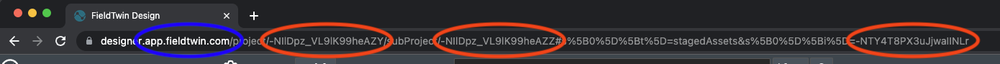

# How to ... with the FieldTwin API

The following examples can be run with the [curl](https://curl.se/) command line
utility or imported into the [Postman](https://www.postman.com/) application
(_File_ menu, _Import_, select _Raw Text_, paste the whole `curl` command, _Continue_,
review and replace the variable placeholders with actual values).

Command line setup for curl commands:

```
export TOKEN=<api token>
export BACKEND_HOST=backend.<your company>.fieldtwin.com
export PROJECT=<project id>
export SUBPROJECT=<subproject id>
```

The API token can be created by an administrator in FieldTwin Admin from the
Account Settings / API section. It must be created for the same account that the
project lives in. API tokens are powerful so once you are familiar with the API
you might (depending on your use case) [change to use a JWT instead](#provide-a-jwt-instead-of-an-api-token).

The IDs of the project and subproject (and objects below) can be found from the
URL in your browser's address bar when the project is open in FieldTwin Design.
They look like this: `-MeidQjcOmxpYWFIq5zp`.



<br>
<hr>

## Create a manifold

[docs link](https://api.fieldtwin.com/#api-StagedAssets-AddStagedAsset)

```
curl -H "token: ${TOKEN}" \
     -H "content-type: application/json" \
     --request POST \
     --data '{
                "name": "New Manifold #1",
                "asset": "-K5uq-URmQV-aH0-uBpF",
                "tags": [],
                "initialState": {
                    "rotation": 0,
                    "x": 135277.5,
                    "y": 6565034.6,
                    "scale": 1
                },
                "metaData": []
            }' \
     https://${BACKEND_HOST}/API/v1.9/${PROJECT}/subProject/${SUBPROJECT}/stagedAsset
```

* Asset ID `-K5uq-URmQV-aH0-uBpF` equates to a Manifold in FutureOn's standard asset library
  * The list of available assets can be found by calling `/API/v1.9/assets`
* Coordinate values are provided inside the bounds and in the unit of the
  [Coordinate Reference System](https://design.fieldtwin.com/dashboard/#project-settings)
  defined for the project
  * For example meters for [EPSG:23031](https://epsg.io/23031) or us-feet for [EPSG:3452](https://epsg.io/3452)
* For subsea assets the `z` value is automatically set from the bathymetry if uploaded,
  or else the seabed level defined for the project
* `z` values in FieldTwin are `0` at sea level, negative below sea level and positive
  above sea level

<br>
<hr>

## Delete a staged asset

[docs link](https://api.fieldtwin.com/#api-StagedAssets-DeleteStagedAsset)

```
export STAGEDASSET=<staged asset id>

curl -H "token: ${TOKEN}" \
     --request DELETE \
     https://${BACKEND_HOST}/API/v1.9/${PROJECT}/subProject/${SUBPROJECT}/stagedAsset/${STAGEDASSET}
```

<br>
<hr>

## Get a 3D well bore profile

[docs link](https://api.fieldtwin.com/#api-Wells-GetWell)

```
export WELL=<well id>

curl -H "token: ${TOKEN}" \
     https://${BACKEND_HOST}/API/v1.9/${PROJECT}/subProject/${SUBPROJECT}/well/${WELL}
```

* The bore profile is returned in the `wellBores[0 .. n].path` attribute
* The bore path is empty by default, it can be set or imported from FieldTwin Design

<br>
<hr>

## Get the generated seabed profile for a connection

[docs link](https://api.fieldtwin.com/#api-Connections-GetConnection)

```
export SAMPLE_RESOLUTION=5
export CONNECTION=<connection id>

curl -H "token: ${TOKEN}" \
     -H "sample-every: ${SAMPLE_RESOLUTION}" \
     -H "simplify: true" \
     https://${BACKEND_HOST}/API/v1.9/${PROJECT}/subProject/${SUBPROJECT}/connection/${CONNECTION}
```

* The value of sample resolution can be `1` or more
* Providing `simplify: true` removes the points that fall in a straight line which reduces the data size
* The connection profile is returned in the `sampled` attribute

<br>
<hr>

## Get and set metadata values

Metadata values are stored in the `metaData` array attribute on objects in the field.
You can see the general data structure by requesting a single connection / staged asset / well / layer / shape:

```
export CONNECTION=<connection id>

curl -H "token: ${TOKEN}" \
     https://${BACKEND_HOST}/API/v1.9/${PROJECT}/subProject/${SUBPROJECT}/connection/${CONNECTION}
-->
{
     "visible": true,
     "fromSocket": "b",
     "toSocket": "a",
     "params": {
          "type": 4,
          "label": "Water Injection #1",
          "width": 1
     },
     "from": { ... },
     "to": { ... },
     ...
     "metaData": [
          {
               "id": "-NTruDmpGaWmFq5dY1UL",
               "metaDatumId": "-MX1hgyA5rMYnffSIDqS",
               "metaDatumLinkId": "-NTruDmpGaWmFq5dY1UL",
               "definitionId": "IntegrationsTeam:CustomString[string]",
               "name": "Custom String",
               "type": "string",
               "tags": [],
               "value": "my string",
               "cost": 0,
               "costPerLength": false,
               "vendorAttributes": {}
          },
          {
               "id": "-NTruFFZ1QdcHPX7DsWg",
               "metaDatumId": "-MKeJ9PrkJXvPLg9vYzB",
               "metaDatumLinkId": "-NTruFFZ1QdcHPX7DsWg",
               "definitionId": "IntegrationsTeam:KeyPoints[table]",
               "name": "Key Points",
               "type": "table",
               "tags": [],
               "value": [
                    {
                         "-MKeJHF9Q0jyb4AIwicf": "1",
                         "-MKeJIq3E-RffPBFbJdG": "100"
                    },
                    {
                         "-MKeJHF9Q0jyb4AIwicf": "2",
                         "-MKeJIq3E-RffPBFbJdG": "200"
                    }
               ],
               "cost": 0,
               "costPerLength": false,
               "vendorAttributes": {}
          }
     ]
}
```

:warning: At the time of writing (FieldTwin 7.0), requesting a whole subproject will return
metadata values for the connections, staged assets and shapes but not for wells and layers - 
metadata for these must be fetched with separate API calls.

To add or change the metadata values for an object, `PATCH` the object by sending the
`metaData` array with only the metadata attributes to update. The minimum attributes to
send are the `metaDatumId` (identifying the relevant metadatum definition) and `value`.

The following example updates the 2 metadata values on the connection shown above.

```
export CONNECTION=<connection id>

curl -H "token: ${TOKEN}" \
     -H "content-type: application/json" \
     --request PATCH \
     --data '{
                "metaData": [
                    {
                         "metaDatumId": "-MX1hgyA5rMYnffSIDqS",
                         "value": "Flexible"
                    },
                    {
                         "metaDatumId": "-MKeJ9PrkJXvPLg9vYzB",
                         "value": []
                    }
                ]
            }' \
     https://${BACKEND_HOST}/API/v1.9/${PROJECT}/subProject/${SUBPROJECT}/connection/${CONNECTION}
```

:warning: When a metadatum value has been cleared or has not been set, the `value` attribute
will be missing from the metadatum object. In your code be sure to check that `value` exists
before reading from it. The data type and content of `value` varies depending on the
metadatum's `type`. The following types are supported:

### string

To set a string, provide a string in `value`:

```
PATCH object
<--
{ "metaData": [{
     "metaDatumId": "-MHm9G9TaN4W_4jMYPHl",
     "value": "value as a string"
}]}
```

### numerical and slider

To set a numerical, provide an integer or a floating point number in `value`.
To set the unit (if applicable), specify the unit in the `option` attribute
(for example `mm`, `ft3`, `C`, `sm3/m3`, `W/m2/C`):

```
PATCH object
<--
{ "metaData": [{
     "metaDatumId": "-MHm9G9TaN4W_4jMYPHl",
     "value": 150.1,
     "option": "m"
}]}
```

### boolean

To set a boolean, provide the string `true` or `false` in `value`:

```
PATCH object
<--
{ "metaData": [{
     "metaDatumId": "-MHm9G9TaN4W_4jMYPHl",
     "value": "true"
}]}
```

Depending on your use case, if the `value` attribute is missing (meaning that no
value has been saved) you may want to treat this as `false`.

### choices - single selection

Use [Request all metadata definitions](https://api.fieldtwin.com/#api-MetadataDefinitions-GetMetaDataDefinitions)
or [Request one metadata definition](https://api.fieldtwin.com/#api-MetadataDefinitions-GetMetaDataDefinition)
with the `metaDatumId` to fetch the metadatum definition and its list of possible choices.

Each choice is its own separate object with attributes for: `id`, `name`, and optionally
a `customValue`. The name is what is displayed in the user interface, and the custom value
(if present) is the value to use for the choice instead of its name.

When reading metadata, the `value` will be the selected choice object. For example:

```
GET object
-->
"metaData": [
     {
          "id": "-NTsQ5XGQctE7dDV5OrH",
          "metaDatumId": "-MX1hgyA5rMYnffSIDqS",
          "metaDatumLinkId": "-NTsQ5XGQctE7dDV5OrH",
          "definitionId": "MyAccount:NumberOfSlots[choices]",
          "name": "Number of slots",
          "type": "choices",
          "tags": [],
          "value": {
               "id": "-NTt33VQYMf-LD6VKZzR",
               "name": "6 Slot",
               "customValue": "6",
               "filterValue": []
          },
          "cost": 0,
          "costPerLength": false,
          "vendorAttributes": {}
     }
]
```

So the final metadata value to use here is `6`, or it would be `6 Slot` if there was
no `customValue`.

To set a choice, provide one of the choice objects in `value`.
You can provide just the `id` of the choice object if you prefer:

```
PATCH object
<--
{ "metaData": [{
     "metaDatumId": "-MX1hgyA5rMYnffSIDqS",
     "value": { "id": "-NTt33VQYMf-LD6VKZzR" }
}]}
```

### choices - multiple selection

This case is similar to _choices - single selection_, but the `value` is now an array
of choice objects. To clear all choices, apply a zero length array:

```
PATCH object
<--
{ "metaData": [{
     "metaDatumId": "-MX1hgyA5rMYnffSIDqS",
     "value": []
}]}
```

Or to select 2 choices:

```
PATCH object
<--
{ "metaData": [{
     "metaDatumId": "-MX1hgyA5rMYnffSIDqS",
     "value": [
          { "id": "-NTt33VQYMf-LD6VKZzR" },
          { "id": "-NTt34S9xlSnOcx-FAhy" }
     ]
}]}
```

### asset

A type of asset allows for the selection of an asset from the asset library or a
virtual asset defined in FieldTwin Admin. All metadata values associated with the
selected asset will then be presented in FieldTwin and nested inside this metadatum
object in a new `subValue` attribute.

The `value` to store in the metadatum object is the ID of the asset definition
or the virtual asset. Request the list of allowable IDs using
[Request the list of asset definitions](https://api.fieldtwin.com/#api-Assets-GetAssets).

To set an asset and create the nested `subValue` containing that asset's metadata,
provide the asset ID as a string in `value`:

```
PATCH object
<--
{ "metaData": [{
     "metaDatumId": "-MHm9G9TaN4W_4jMYPHl",
     "value": "-M3LRYZGl2h0K902juxA"
}]}
```

### connection

A type of connection allows for the selection of a connection type. All metadata
values associated with the selected connection type will then be presented in FieldTwin
and nested inside this metadatum object in a new `subValue` attribute.

The `value` to store in the metadatum object is the ID of the connection type.
Request the list of allowable IDs using
[Request the list of connection definitions](https://api.fieldtwin.com/#api-Accounts-GetAccountConnections).

To set a connection type and create the nested `subValue` containing that connection's metadata,
provide the definition ID in `value`:

```
PATCH object
<--
{ "metaData": [{
     "metaDatumId": "-MHm9G9TaN4W_4jMYPHl",
     "value": 4
}]}
```

:warning: At the time of writing (FieldTwin 7.0) the pre-installed connection types
have a numeric ID while custom connection types have a string ID.

### table

Use [Request all metadata definitions](https://api.fieldtwin.com/#api-MetadataDefinitions-GetMetaDataDefinitions)
or [Request one metadata definition](https://api.fieldtwin.com/#api-MetadataDefinitions-GetMetaDataDefinition)
with the `metaDatumId` to fetch the metadatum definition and its list of table headers.

Each table header / column in the definition has an `id` and `name`.

The metadatum `value` is an array of rows, where each row is a key/value object with
the column ID as its key.

To set a 2x2 table, provide the following array in `value`:

```
PATCH object
<--
{ "metaData": [{
     "metaDatumId": "-MHm9G9TaN4W_4jMYPHl",
     "value": [
          {
               "id-of-column-1": "col A row 1",
               "id-of-column-2": "col B row 1"
          },
          {
               "id-of-column-1": "col A row 2",
               "id-of-column-2": "col B row 2"
          }
     ]
}]}
```

### button

Button metadata shows a button on the user interface that launches a web page when clicked.
It does not have a `value` and setting one has no effect.

<br>
<hr>

## Visualise custom data for a staged asset

[docs link](https://api.fieldtwin.com/#api-StagedAssets-SetStagedAsset)

Custom results are names and values displayed in a box next to the staged asset in
FieldTwin Design. They can be used for displaying simulation results or operational
data.

```
export STAGEDASSET=<staged asset id>

curl -H "token: ${TOKEN}" \
     -H "content-type: application/json" \
     --request PATCH \
     --data '{
                "customResults": {
                    "Current": [
                        {"name": "Service", "value": "Production", "type": "string"},
                        {"name": "Valve 1 cycles", "value": 384, "type": "decimal"},
                        {"name": "Valve 2 cycles", "value": 410, "type": "decimal"},
                        {"name": "Current Pressure", "value": 5113, "type": "decimal"},
                        {"name": "Current Temp", "value": 60, "type": "decimal"}
                    ]
                },
                "showCustomResults": true
            }' \
     https://${BACKEND_HOST}/API/v1.9/${PROJECT}/subProject/${SUBPROJECT}/stagedAsset/${STAGEDASSET}
```

To hide the custom results in FieldTwin Design:

```
curl -H "token: ${TOKEN}" \
     -H "content-type: application/json" \
     --request PATCH \
     --data '{ "showCustomResults": false }' \
     https://${BACKEND_HOST}/API/v1.9/${PROJECT}/subProject/${SUBPROJECT}/stagedAsset/${STAGEDASSET}
```

<br>
<hr>

## Visualise custom data along a connection

[docs link](https://api.fieldtwin.com/#api-Connections-SetConnection)

Connection visualisation data is displayed at key points on or alongside a connection
in FieldTwin Design. This can be used for displaying simulation results, survey results
or operational data.

```
export CONNECTION=<connection id>

curl -H "token: ${TOKEN}" \
     -H "content-type: application/json" \
     --request PATCH \
     --data '{
                "visualisationMaps": [{
                    "id": "connection-1-custom-temp",
                    "name": "Temperature Survey",
                    "normalizedKp": false,
                    "rendering": "bar",
                    "data": [
                        {"kp": 100, "v": 68},
                        {"kp": 200, "v": 67},
                        {"kp": 300, "v": 66},
                        {"kp": 400, "v": 65},
                        {"kp": 500, "v": 64}
                    ]
                }],
                "visibleVisualisationMapId": "connection-1-custom-temp"
            }' \
     https://${BACKEND_HOST}/API/v1.9/${PROJECT}/subProject/${SUBPROJECT}/connection/${CONNECTION}
```

* The visualisation data is provided as an array of key points `kp` as a distance
  along the connection and a corresponding numeric value `v`
* When `normalizedKp` is true, the key point `kp` is a value between `0` and `1`
  instead of a value in feet/meters (so `0.5` would be half way along the connection)
* A palette for the visualisation can also be provided, but a default palette is
  generated by default

To hide the visualisation in FieldTwin Design:

```
curl -H "token: ${TOKEN}" \
     -H "content-type: application/json" \
     --request PATCH \
     --data '{ "visibleVisualisationMapId": null }' \
     https://${BACKEND_HOST}/API/v1.9/${PROJECT}/subProject/${SUBPROJECT}/connection/${CONNECTION}
```

<br>
<hr>

## Store custom data at project level

[docs link (write)](https://api.fieldtwin.com/#api-Projects-PatchProject)  
[docs link (read)](https://api.fieldtwin.com/#api-Projects-GetProjectVendorAttributes)

FieldTwin provides the `vendorAttributes` attribute on many objects including account,
project, subproject, staged asset, connection, and document. This can be used to attach
custom data to the object. There is no built-in visualisation of this data.

Because `vendorAttributes` can be used by more than one integration or for more than one
purpose, we use a convention of storing data objects inside a child key to keep the different
uses separate. The API will merge the provided top-level key(s) into the `vendorAttributes`
without overwriting other existing top-level keys.

```
curl -H "token: ${TOKEN}" \
     -H "content-type: application/json" \
     --request PATCH \
     --data '{ "vendorAttributes": { "myIntegration": { "foo": "bar" } } }' \
     https://${BACKEND_HOST}/API/v1.9/${PROJECT}
```

Example of data separation using keys:

```
curl -H "token: ${TOKEN}" \
     -H "content-type: application/json" \
     --request PATCH \
     --data '{ "vendorAttributes": { "drillPro": { "settings": { "name": "Drill Pro v1" } } } }' \
     https://${BACKEND_HOST}/API/v1.9/${PROJECT}

curl -H "token: ${TOKEN}" \
     -H "content-type: application/json" \
     --request PATCH \
     --data '{ "vendorAttributes": { "heatCalc": { "scenario": "Base Case", "autoCalc": true, "pipes": ["c-1", "c-2", "c-3"] } } }' \
     https://${BACKEND_HOST}/API/v1.9/${PROJECT}

curl -H "token: ${TOKEN}" \
     https://${BACKEND_HOST}/API/v1.9/${PROJECT}/vendorAttributes
-->
     {
          "drillPro": {
               "settings": {
                    "name": "Drill Pro v1"
               }
          },
          "heatCalc": {
               "scenario": "Base Case",
               "autoCalc": true,
               "pipes": ["c-1", "c-2", "c-3"]
          }
     }
```

* Only one level of keys is merged into `vendorAttributes`
     * In the above example, to add something new into `drillPro` you have to PATCH
       the whole `drillPro` object a second time
* To delete one set of `vendorAttributes`,
  send PATCH data of the format: `{ "vendorAttributes": { "myIntegration": null } }`

<br>
<hr>

## Request linked (parent/child) subprojects

[docs link](https://design.fieldtwin.com/dashboard/#links)

By default, requesting a child subproject returns the sum of objects from both the parent
subproject(s) and the child. Objects that are automatically merged from a parent subproject
have a different `subProject` value and are given additional attributes in the JSON:

```
curl -H "token: ${TOKEN}" \
     https://${BACKEND_HOST}/API/v1.9/${PROJECT}/subProject/${SUBPROJECT}
-->
{
     "id": "-MjF6TYxJ-mkAzWnnsfa",
     "name": "Child Subproject",
     "stagedAssets": {
          "-MkaNgEfqAYhqyhQHNsz": {
               "name": "Local FPSO #1",
               "visible": true,
               "subProject": "-MjF6TYxJ-mkAzWnnsfa"
          },
          "-MjF4vtXQ574Bid3Zbs2": {
               "name": "XMT from parent backdrop",
               "visible": true,
               "subProject": "-MjF3wciX_dTQzLL4aOu",
               "project": "-MjF3L9vJdSXSOiYZiMQ",
               "isForeign": true,
               "getFromSubProject": "https://example.fieldtwin.com/API/v1.9/-MjF3L9vJdSXSOiYZiMQ/subProject/-MjF3wciX_dTQzLL4aOu",
               "getFrom": "https://example.fieldtwin.com/API/v1.9/-MjF3L9vJdSXSOiYZiMQ/subProject/-MjF3wciX_dTQzLL4aOu/stagedAsset/-MjF4vtXQ574Bid3Zbs2"
          }
     }
}
```

If you wish to request a child subproject without merging the items from the parent(s),
set the `merge-foreign` request header to `false`. The parent objects are then returned
in a separate list of `foreignSubProjects`.

```
curl -H "token: ${TOKEN}" \
     -H "merge-foreign: false" \
     https://${BACKEND_HOST}/API/v1.9/${PROJECT}/subProject/${SUBPROJECT}
-->
{
     "id": "-MjF6TYxJ-mkAzWnnsfa",
     "name": "Child Subproject",
     "stagedAssets": {
          "-MkaNgEfqAYhqyhQHNsz": {
               "name": "Local FPSO #1",
               "visible": true,
               "subProject": "-MjF6TYxJ-mkAzWnnsfa"
          }
     },
     "foreignSubProjects": [
          {
               "id": "-MjF3wciX_dTQzLL4aOu",
               "name": "Parent Project 1",
               "stagedAssets": {
                    "-MjF4vtXQ574Bid3Zbs2": {
                         "name": "XMT from parent backdrop",
                         "visible": true,
                         "subProject": "-MjF3wciX_dTQzLL4aOu",
                         "project": "-MjF3L9vJdSXSOiYZiMQ",
                         "isForeign": true
                    }
               }
          }
     ]
}
```

Requesting a parent subproject returns only the objects that live in the parent.

<br>
<hr>

## Use Smart Models

[docs link](https://design.fieldtwin.com/Releasenotes/#smart-models)

Smart 3D models consist of special 3D assets that can be combined together as components
to create a customized staged asset. The customizations are controlled by setting special
metadata attributes.

To use smart models, ask FutureOn to deploy the required smart assets and associated
metadata definitions into your Asset Library.

When a staged asset is created from a smart model in FieldTwin, its "docking slots" will
be made available as metadata values with `"type": "asset"`:

```
export STAGEDASSET=<staged asset id>

curl -H "token: ${TOKEN}" \
     https://${BACKEND_HOST}/API/v1.9/${PROJECT}/subProject/${SUBPROJECT}/stagedAsset/${STAGEDASSET}
-->
{
     "name": "5MW Wind Turbine #1",
     "visible": true,
     "virtual": false,
     ...
     "metaData": [{
          "id": "-N5o5X-wuAK1D25k249p",
          "metaDatumId": "-N5o5X-wuAK1D25k249e",
          "metaDatumLinkId": "-N5o5X-wuAK1D25k249p",
          "definitionId": "WindPOC:5MWMonoPile[asset]",
          "name": "5MW MonoPile",
          "type": "asset",
          "tags": [],
          "cost": 0,
          "costPerLength": false,
          "subValue": []
     },
     ...
     ]
}
```

In the above example, there is no `value` attribute in the `metaData` object. The docking slot
for `5MW MonoPile` is empty. To add a monopile component to the parent staged asset, set the
`value` to the ID of an allowable asset from the asset library (note: use the ID of an asset
definition, not a staged asset):

```
curl -H "token: ${TOKEN}" \
     -H "content-type: application/json" \
     --request PATCH \
     --data '{
                "metaData": [{
                    "id": "-N5o5X-wuAK1D25k249p",
                    "metaDatumId": "-N5o5X-wuAK1D25k249e",
                    "value": "-N4Rz5E2U88Qoq02TLF2"
                }]
            }' \
     https://${BACKEND_HOST}/API/v1.9/${PROJECT}/subProject/${SUBPROJECT}/stagedAsset/${STAGEDASSET}
```

To find the allowable asset IDs for a docking slot, first request the metadata definition
using the metadata definition ID in `metaDatumId`:

```
curl -H "token: ${TOKEN}" \
     https://${BACKEND_HOST}/API/v1.9/metadatadefinitions/-N5o5X-wuAK1D25k249e
-->
{
     "name": "5MW MonoPile",
     "definitionId": "WindPOC:5MWMonoPile[asset]",
     "vendorAttributes": {},
     "shouldFilterChoices": false,
     "options": {
          "unit": {},
          "filter": {
               "assetSubCategories": ["5MW WT MP F"],
               "assetCategories": ["Wind"],
               "assetTypes": ["vessel"],
               "assetSubTypes": ["WindTurbine"]
          }
     },
     "cost": 0,
     "costPerLength": false,
     "order": 280000,
     "public": false,
     "tags": [],
     "clonedFroms": [],
     "hideInInfoPanel": false,
     "global": false,
     "id": "-N5o5X-wuAK1D25k249e",
     "displayIfConditions": [],
     "type": "asset",
     "account": "-MY45O6R7qkBUXnN1uTb"
}
```

Then use the filters given in `options.filter` to find asset definitions in the asset
library that match the filters:

```
curl -H "token: ${TOKEN}" \
     https://${BACKEND_HOST}/API/v1.9/assets
-->
{
     ...
     "-N4Rz5E2U88Qoq02TLF2": {
          "name": "5MW MonoPile",
          "description": "",
          "category": "Wind",                          // match on filter.assetCategories
          "subCategory": "5MW WT MP F",                // match on filter.assetSubCategories
          "type": "vessel",                            // match on filter.assetTypes
          "subType": "WindTurbine",                    // match on filter.assetSubTypes
          "imageUrl": "https://...",
          "model3dUrl": "https://...",
          "sockets2d": [],
          "dockingMales": [],
          "dockingFemale": { ... },
          "params": {
               "isGLTF": true,
               "width": 8.557730674743652,
               "height": 8.557730831003877,
               "left": -4.278812885284424,
               "top": -4.27881488333273
          },
          "shared": true,
          "filename3D": "5MW_MonoPile.glb - Wed, 22 Jun 2022 11:24:30 GMT",
          "filename2D": "5MW_MonoPile.png - Mon, 13 Jun 2022 12:09:54 GMT",
          "filenameSockets": "5MW_MonoPile.sockets - Wed, 22 Jun 2022 11:28:23 GMT",
          "hideInAssetLibrary": true
     },
     ...
}
```

In this example the allowable values for the `5MW MonoPile` docking slot in the
parent staged asset are:

* `-N4Rz5E2U88Qoq02TLF2` to create a `5MW MonoPile` in the slot, or
* `null` to set the docking slot as empty

<br>
<hr>

## Provide a JWT instead of an API token

A JWT is passed to an integration in the [`loaded` window message](./INTEGRATIONS.md#loaded)
and optionally in the request parameters of an integration's URL.

Unlike an API token, a JWT is restricted to the current user's permissions for
the open project, it does not allow account administration, and it expires after
1 hour (by default). Listen out for the `tokenRefresh` window message to receive
a new JWT before the old one expires.

You should replace the `Token` header with an `Authorization` header; do not provide both.

```
export JWT=<jwt value>

curl -H "Authorization: Bearer ${JWT}" \
     https://${BACKEND_HOST}/API/v1.9/${PROJECT}/subProject/${SUBPROJECT}
```

For integration user interfaces and settings pages you should use the provided JWT
whenever possible. API tokens are suitable for back-end tasks when there is no user
session or when administration permission is required.
