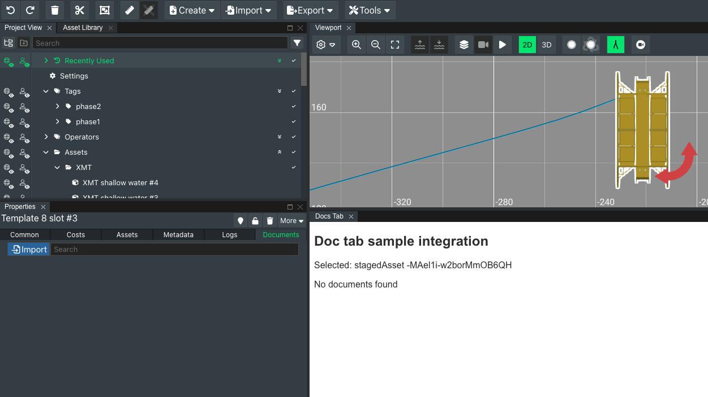
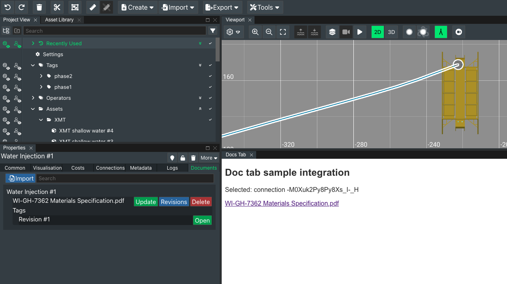

# Doc tab

## Description

This tool is deployed as a tab inside FieldTwin Design. It shows how to respond to
window messages, call the FieldTwin API, and display results in the tab.

This example queries FieldTwin for any documentation that has been uploaded for the
selected object in FieldTwin. Selecting a new object on the canvas refreshes the list
of uploaded documents.

## Installation

1. Self-hosted option: deploy the file `index.html` on a public or private web
   hosting service and obtain the URL to reach it  
   or  
   Pre-hosted option: use the URL `https://xvisionas.github.io/FieldTwin-Integration-Demo/doc-tab/`
2. In FieldTwin Admin, go to Account Settings, then Integrations, and click _Create New Tab_.
   Set the following values:  
   ```
   Name:                           Docs Tab
   URL:                            <the URL from step 1>
   Use GET verb:                   yes
   Do not pass arguments in URL:   yes
   Tab Display Position:           Module Panel (default)
   ```

## Usage

1. Open a project in FieldTwin Design, click the Layout button, and select _Docs Tab_
   (or the name you entered in step 2 of installation above)
2. Drag the tab to a convenient location in FieldTwin Design
3. Select a connection, staged asset, well, or layer
4. The integration will show the documents that have been uploaded in FieldTwin
   for the selected object

To upload a document for an object, select it, go to the _Properties_ tab, then the
_Documents_ child tab.




