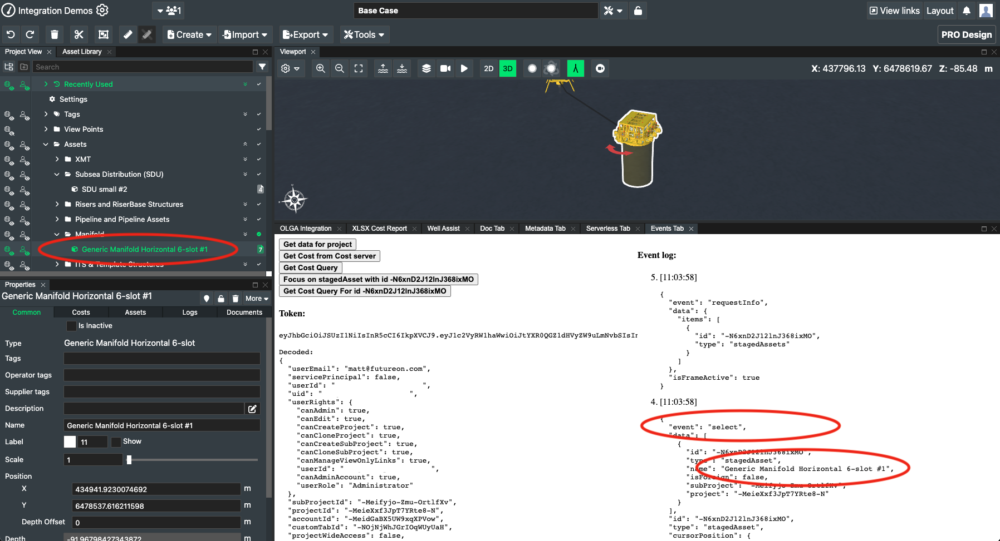

# Events tab

## Description

A testing and debugging tool that is deployed as a tab inside FieldTwin Design.

* Prints the decoded JWT (access token), showing the user and project IDs and the user's permissions
* Prints all [integration window messages](../INTEGRATIONS.md#communication-from-fieldtwin-to-integration)
  received from FieldTwin as they arrive
* Buttons to send window messages to FieldTwin

## Installation

1. Self-hosted option: deploy the file `index.html` on a public or private web
   hosting service and obtain the URL to reach it  
   or  
   Pre-hosted option: use the URL `https://xvisionas.github.io/FieldTwin-Integration-Demo/events-tab/`
2. In FieldTwin Admin, go to Account Settings, then Integrations, and click _Create New Tab_.
   Set the following values:  
   ```
   Name:                           Events Tab
   URL:                            <the URL from step 1>
   Use GET verb:                   yes
   Do not pass arguments in URL:   yes
   Tab Display Position:           Module Panel (default)
   ```

## Usage

1. Open a project in FieldTwin Design, click the Layout button, and select _Events Tab_
   (or the name you entered in step 2 of installation above)
2. Drag the tab to a convenient location in FieldTwin Design
3. Use FieldTwin Design normally
4. The tab will show selection and change events as they arrive


