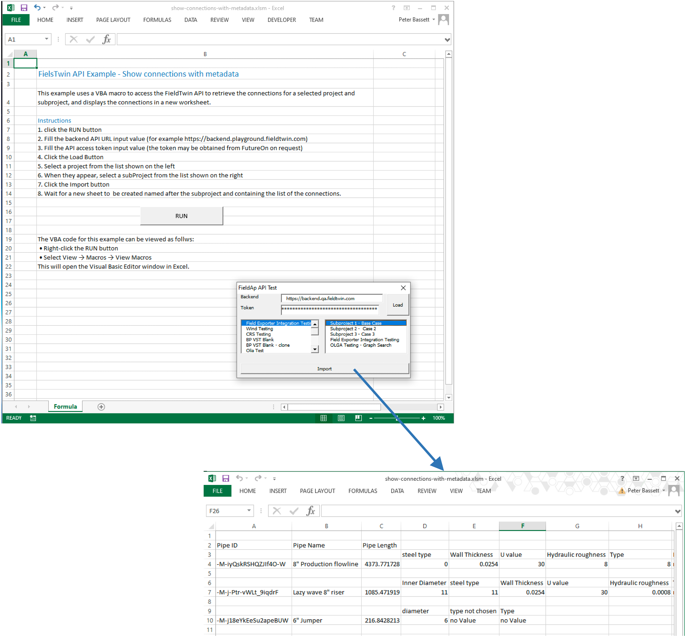

# FieldTwin API Excel Macros Examples

This folder provide some example Excel spreadsheets using VBA macros to 
access the FieldTwin API.

## show-connections-with-metadata.xlsm

This Excel spreadsheet example uses VBA macros to access the connections for a 
selected project and subproject, and displays the connections in a new worksheet.   

