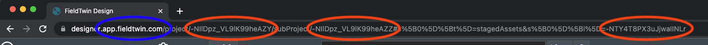

# FieldTwin API Excel Macros Examples

This folder provide some example Excel spreadsheets using VBA macros to access the FieldTwin API.

Note that these workbooks require the Excel desktop application running on Microsoft Windows.

## show-connections-with-metadata.xlsm

This Excel spreadsheet example uses VBA macros to access the connections for a selected project
and subproject, and displays the list of connections in a new worksheet.

 

## write-metadata-example.xlsm

This Excel spreadsheet provides example VBA macros to read a metadata value for a FieldTwin staged
asset using the API, and to write an updated metadata value back to the staged asset.

To obtain the required project ID, subproject ID and staged asset ID, open an existing project
in FieldTwin Design and select (click on) a staged asset that contains metadata. The three IDs
can then be copied from the address bar.

The macro looks for the metadata value that is associated with a particular Vendor ID.
If you are using FutureOn's standard metadata library this will begin with `Std.`.
You can use FieldTwin Admin to review the metadata definitions and see which have a Vendor ID assigned.
