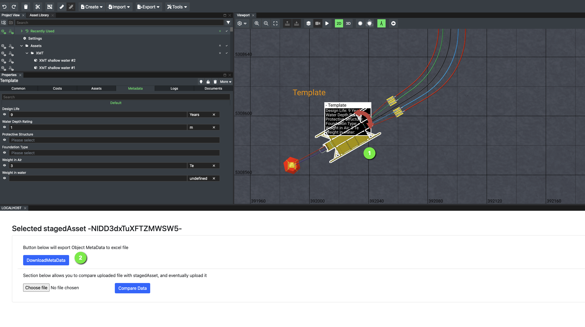
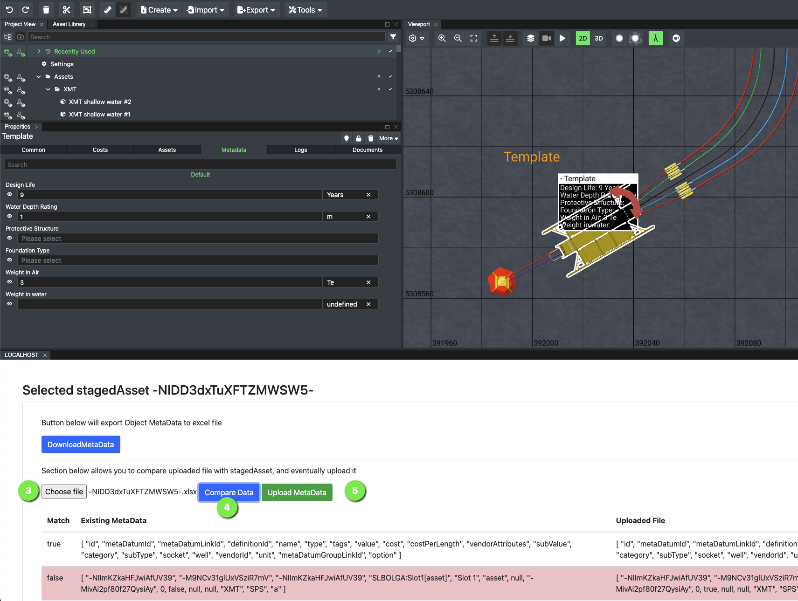

# Metadata import-export

## Description

This tool is deployed as a tab inside FieldTwin Design. It shows how to respond to
window messages, call the FieldTwin API, download and upload metadata using an Excel
spreadsheet.

This example uses the [SheetJS library](https://sheetjs.com/) for Excel compatibility
and queries FieldTwin for metadata attached to a staged asset, connection or well.

## Installation

1. Self-hosted option: deploy the file `index.html` on a public or private web
   hosting service and obtain the URL to reach it  
   or  
   Pre-hosted option: use the URL `https://xvisionas.github.io/FieldTwin-Integration-Demo/metadata-import-export/`
2. In FieldTwin Admin, go to Account Settings, then Integrations, and click _Create New Tab_.
   Set the following values:  
   ```
   Name:                           Metadata Tab
   URL:                            <the URL from step 1>
   Use GET verb:                   yes
   Do not pass arguments in URL:   yes
   Tab Display Position:           Module Panel (default)
   ```

## Usage

1. Open a project in FieldTwin Design, then select a staged asset, connection or well
2. Download the selected object's metadata as an Excel file



3. To import, select a local Excel file containing the same data columns
4. Click the _Compare_ button to upload the file and compare the current current
   metadata with the uploaded metadata
5. Click the _Store_ button to save the values from the uploaded file in FieldTwin


