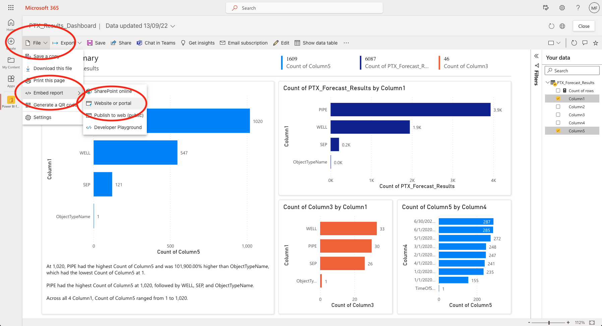

# Power BI

## Installation

A Power BI report can be displayed in FieldTwin as integration tab. The process is as follows:

1. Open the report in Power BI
2. Click _File_, _Embed Report_, to _Website or portal_

3. Copy the provided link

4. In FieldTwin Admin, select an account, navigate to _Integrations_, click _Create New Tab_
5. Enter a name for the tab
6. Paste the embed link copied from Power BI into _URL_
7. Enable _Use GET_ and _Do not pass arguments in URL_

8. Open a project in FieldTwin Design
9. Click the _Layout_ button and select the new tab to add it to the view

10. Click Power BI's _Sign In_ button to sign into Power BI
11. The Power BI report is now shown inside FieldTwin

