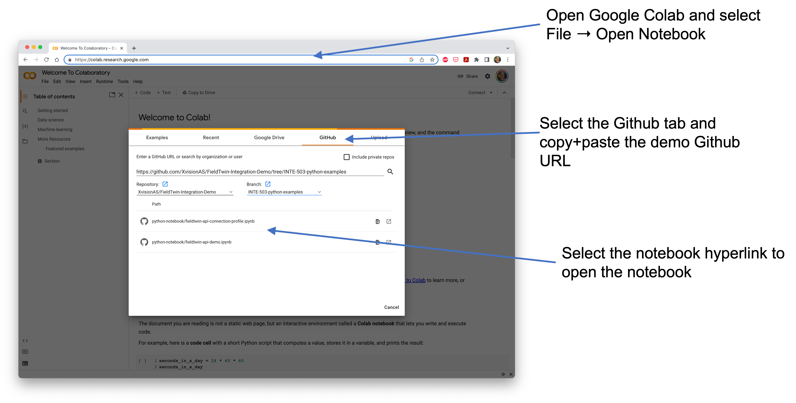

# FieldTwin API Python Notebook Examples

This fieldtwin-api-demo.ipynb provides example python code
demonstrating how to access the FieldTwin REST API.

## API Token

In order to execute the FieldTwin API calls, it is necessary to obtain an API token from FutureOn. 
When the first cell in the notebook is run, it will provide a text box where the API token can be pasted and entered. This token is then used for the subsequent API calls in the following cells.

## The API Examples

There are two example python notebooks:
* `fieldtwin-api-connection-profile.ipynb` - an example loading a FieldTwin subproject and providing the option to
  select a connection and display the connection profile.
* `fieldtwin-api-demo.ipynb` - an example loading a FieldTwin subproject and demonstrating API GET and PATCH operations.

## How to run the example code

The examples in the notebook can be run using the python jupyter notebook environment. This provides a python runtime environment, where the code can be edited and run.   

## Run in Google Colab

The simplest way to run the demo notebooks is to use Google Colab.

Google Colab provides a free environment for storing and running python jupyter notebooks.
This can be accessed at https://colab.research.google.com/.

In the Colab web page: 
1. Select File -> Open notebook
2. Select the Github tab.
3. Paste in the github Url for this page.

This will create a link to the notebook which can then be opened in Colab.

