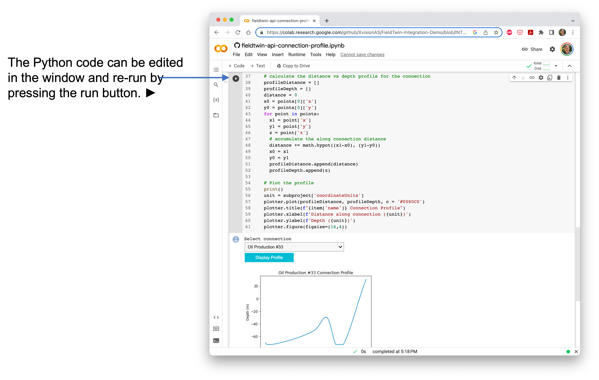

# FieldTwin API Python Notebook Examples

These Jupyter notebooks provide example Python code demonstrating how to access the FieldTwin REST API.

## API Token

In order to execute the FieldTwin API calls, it is necessary to generate an API token
in FieldTwin Admin (or obtain an API token from FutureOn).

When the first cell in the notebook is run, it will provide a text box where the API token can be
pasted into. This token is then used for the subsequent API calls in the following cells.

## The API Examples

There are two example python notebooks:

* `fieldtwin-api-connection-profile.ipynb` - an example loading a FieldTwin subproject
  and providing the option to select a connection and display its connection profile
* `fieldtwin-api-demo.ipynb` - an example loading a FieldTwin subproject and demonstrating
  API GET and PATCH operations

## How to run the example code

The examples can be run using the Python Jupyter notebook environment. This provides a
Python runtime environment where the code can be edited and run.

## Run in Google Colab

The simplest way to run the demo notebooks is to use Google Colab.

Google Colab provides a free environment for storing and running Python Jupyter notebooks.
This can be accessed at https://colab.research.google.com/.

First, download a copy of the `.ipynb` file from this repository.    
In the Colab web page: Select File -> Upload notebook    
Upload the `.ipynb` file    

This will open the notebook in Colab.





## Run in Jupyter Notebook

Alternatively the demos can be run using a local Jupyter Notebook environment.    
See: https://jupyter.org/install

To run the notebook, enter the following commands in a terminal:

```
  cd <folder containing the notebook files>
  jupyter notebook
```

The Jupyter Notebbok application opens in a web browser.   
It displays a list of the notebook files.     
Select the notebook to open.    
Follow the same steps as described above for running in colab.   

