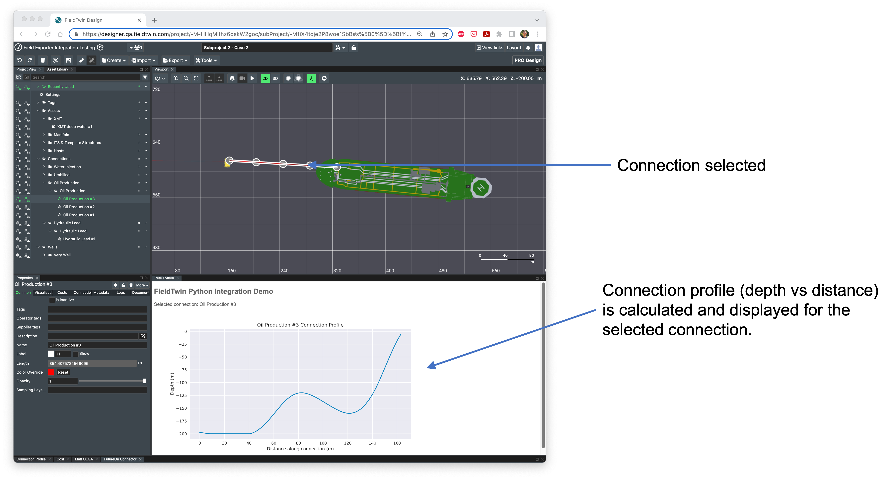
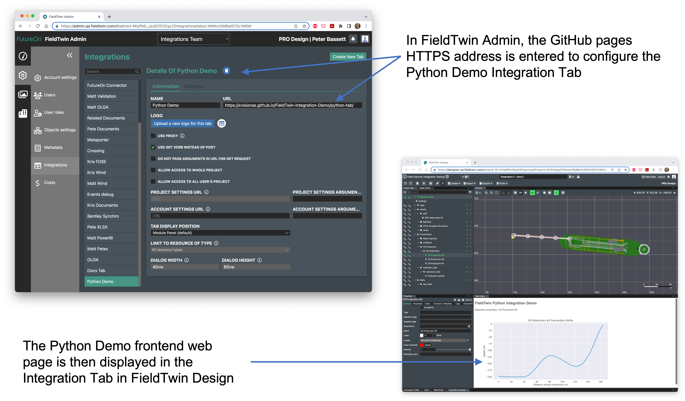
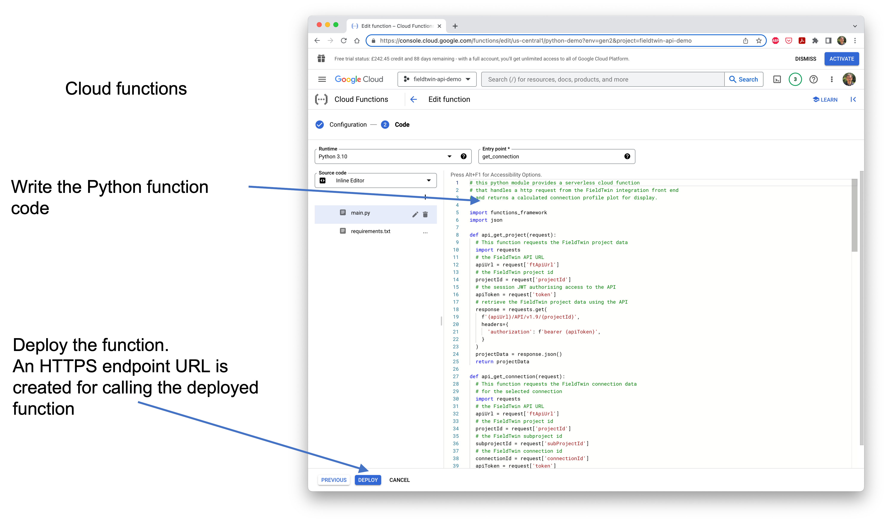

# FieldTwin API Python Integration Example

The example code in this folder provides a demonstration of a FieldTwin Integration application
implamented using a serverless cloud function written in Python.

The example provides a FieldTwin integration where a connection can be selected in FieldTwin Design
and a graph of the connection profile (depth vs distance along the connection) is calculated and displayed.

## Implementation

The example implementation consists of a simple frontend user interface written in `HTML` + `javascript` and a single backend cloud function written in `Python`.

### Frontend user interface

See [index.html](./index.html): This provides the simple iframe display shown above. It responds to window message events from the main FieldTwin Design window.

* On initial startup, it receives a `loaded` message from FieldTwin providing the project and subproject ids, and the API URL and access token required for making requests to the FieldTwin API. 

* After a period of time, a `tokenRefresh` message is sent from FieldTwin to replace the API access token with a new one.

* The iframe also responds to `select` and `unselect` messages from FieldTwin. These are sent whenever an object is selected
or un-selected in FieldTwin. If the selected object is a connection, an HTTP request is created and sent to the backend
cloud function requesting a profile image for the selected connection.

The frontend `index.html` is deployed as a web page using the GitHub pages for this repository. GitHub pages provide the HTTPS URL that is then used for the FieldTwin integration iframe. 

### Backend cloud function

See [cloud-function](./cloud-function/): This consists of a single python function that is deployed to Google's 
serverless Cloud Functions environment. See https://cloud.google.com/functions. Similar products are also provided by Amazon Web Services https://aws.amazon.com/lambda/ and Microsoft Azure https://azure.microsoft.com/en-gb/products/functions.

Cloud Function provide a simple way to develop and deploy backend applications to run in the cloud without 
needing to manage any servers or containers. 

Once the function is written and deployed, an https endpoint URL is created which is used to call the function.

The Python cloud function is called from the frontend javascript code. The call passes parameters providing the projectId, subProjectId and connectionId, the FieldTwin API URL and access token.  

The Python function performs the following:

* The function calls the FieldTwin API to request the project data and connection data
* The depth vs distance profile is calculated from the connection points
* A graph image file of the profile is created
* The image file is returned to the frontend for display  

