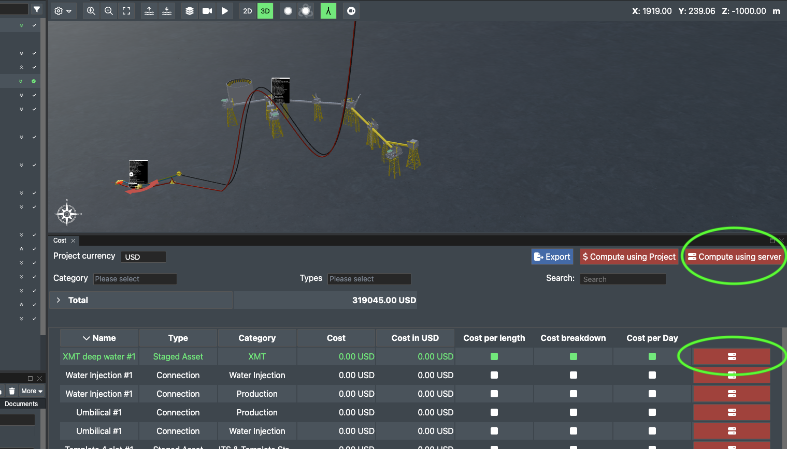
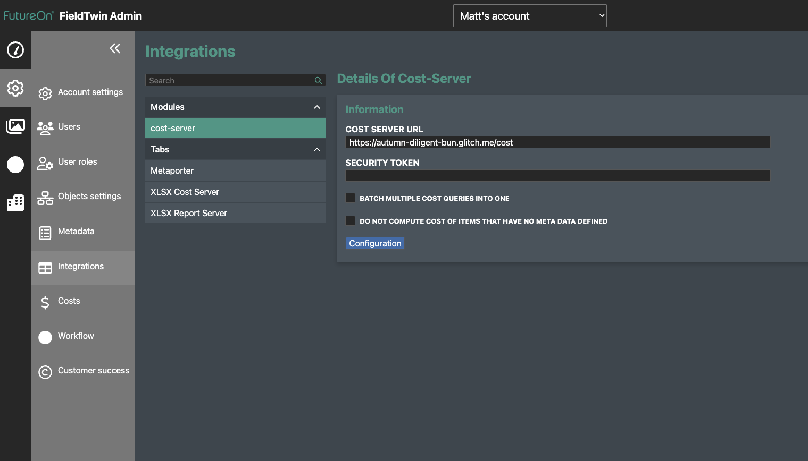

# Creating a cost server to provide the FieldTwin cost computation

Since version 1.5, it is possible to develop a software service that will receive a
request from FieldTwin to compute a cost. In the _Cost_ tab in the user interface,
the service is triggered using the _Compute Using Server_ button for either the whole
subproject or for a single object in the field.



# Setup in FieldTwin

To use the cost server in FieldTwin, ask FutureOn to enable the "cost server" module in
your account. This will provide a setup screen for the service:



Enter the URL of the deployed service and whether to cost objects one at a time (batch mode off)
or cost all objects together (batch mode on). For more information, see _batch request_ below.

# Technical details

The cost server is an HTTP server that replies to a single `POST` request. It can be written
in any language of your choice but the sample code here is server-side Javascript. The URL
FieldTwin should call is defined on the cost server administration page as shown above.

## POST request

By default each `POST` request to the cost server contains information about one object.
So if there are 10 staged assets, the cost server will receive 10 single requests. To
post all 10 at the same time instead, enable _Batch multiple cost requests_ on the cost
server administration page.

### Single request

For each cost computation request, FieldTwin will send all the metadata concerning
the staged asset (or connection) cost in the request body.

Here is an example of a cost request for a connection, with only one metadatum.

```js
{
  "isBatch":false,
  "connections":{
    "-LRQs4ZryGJur2nKAiX6":[
      {
        "id":"-LPXdHZjnMhWQkQjtbk0",
        "name":"Number of Functions",
        "vendorId":"SubSeaSeven",
        "type":"choices",
        "displayIfConditions":[
          {
            "displayIfEqual":[
              {"id":"-LPWmJxjUWyU9OOijkLP"},
              {"id":"-LPWmNIBwD_WN7c_L93-"}
            ],
            "displayIfEqualBis":[],
            "displayIfEqualTer":[],
            "not":false,
            "operator":"or",
            "operandId":"connection-types",
            "order":0,
            "metaDatum":"-LPXdHZjnMhWQkQjtbk0"
          }
        ],
        "displayIfConditionsSorted": [
          {
            "displayIfEqual":[
              {"id":"-LPWmJxjUWyU9OOijkLP"},
              {"id":"-LPWmNIBwD_WN7c_L93-"}
            ],
            "displayIfEqualBis":[],
            "displayIfEqualTer":[],
            "not":false,
            "operator":"or",
            "operandId":"connection-types",
            "order":0,
            "metaDatum":"-LPXdHZjnMhWQkQjtbk0"
            }
          ],
        "value": {"name":"1 to 56","id": "1to56","vendorId":" 1to56"},
        "valueBis":null,
        "currentValue":{"name":"1 to 56", "id":"1to56", "vendorId":"1to56"},
        "option":null,
        "order":0,
        "cost":0,
        "relateToId":"-LPWjqF7ez0RsjYFQFLT",
        "relateToType":"connection",
        "vendorAttributes":
          {"tagId":"numberOf"},
        "costPerLength":false,
        "length":19.096479834244896,
        "displayIfValues": [
          {"id":"connection-types","name":"Connection Type","noDisplay":true,"type":"choices","options":{"items":{}}}
          ],
        "visible":true
      }
    ]
  }
}
```

Here is the reply that the cost server should return:

```js
{
  "connections": {
    "-LRQs4ZryGJur2nKAiX6": {
      "entries": [
        {"number":null, "item":"Random Price", "cost":1000019.0964798343, "description":"", "quantity":1}
        ],
      "stateText":"Computed on: 2018-11-16T10:56:32.819Z",
      "stateType":"success"}
    },
  "stagedAssets": {}
}
```

The reply is a JSON object that must contains two objects with keys `stagedAssets` and
`connections`, each object containing connection/staged asset IDs and an associated cost
object. The cost object contains an  `entries` array, where each entry in this array is
a cost item. The final cost is then computed by summing the cost of every entry, using
`quantity` as a multiplier for the entry.

Each object can have `stateText` which is text that will be displayed in the cost user
interface, as well as `stateType` which determines the color of the text and can be one
of: 'warning', 'danger', 'primary', 'success', 'default'.

### Batch request

In this mode, a request is sent that contains multiple objects in the `connections`
and `stagedAssets` sections. The request body also contains `"isBatch": true`. 
Here is an example:

```js
{
  "isBatch":true,
  "connections":{
    "-KlcQpnk7Ot6U_RYRzc4":[
      {
        "id":"-KWdh7ZJlzWf_0013EAN",
        "name":"Diameter",
        "vendorId":"12345",
        "type":"numerical",
        "value":"12",
        "order":0,
        "cost":0,
        "relateToId":"2",
        "relateToType":"connection",
        "displayIfEqual":[

        ],
        "displayIfEqualBis":[

        ],
        "displayIfEqualTer":[

        ],
        "costPerLength":false,
        "length":50.892759999770526,
        "visible":true,
        "vendorAttributes": { "tagId": "foo"}
      },
      {
        "id":"-KXfhd52DUAIfrbOh6TK",
        "name":"Insulation",
        "vendorId":null,
        "type":"choices",
        "value":{
          "id":4,
          "name":"Insulated",
          "vendorId":""
        },
        "order":1,
        "cost":0,
        "relateToId":"2",
        "relateToType":"connection",
        "displayIfEqual":[

        ],
        "displayIfEqualBis":[

        ],
        "displayIfEqualTer":[

        ],
        "costPerLength":false,
        "length":50.892759999770526,
        "visible":true,
        "vendorAttributes": { "tagId": "bar"}
      },
      {
        "id":"-KbLWRkf5PZDcANaftfX",
        "name":"User specified",
        "vendorId":null,
        "type":"numerical",
        "value":"0",
        "order":2,
        "cost":1000000,
        "relateToId":"2",
        "relateToType":"connection",
        "displayIfEqual":[

        ],
        "displayIfEqualBis":[

        ],
        "displayIfEqualTer":[

        ],
        "costPerLength":false,
        "length":50.892759999770526,
        "visible":true,
        "vendorAttributes": { "tagId": "foo"}
      },
      {
        "id":"-KfNowl7HpQS4ZPe6oCN",
        "name":"Base",
        "vendorId":null,
        "type":"boolean",
        "value":"0",
        "order":3,
        "cost":1000000,
        "relateToId":"2",
        "relateToType":"connection",
        "displayIfEqual":[

        ],
        "displayIfEqualBis":[

        ],
        "displayIfEqualTer":[

        ],
        "costPerLength":false,
        "length":50.892759999770526,
        "visible":true,
        "vendorAttributes": { "tagId": "bar"}
      }
    ]
  },
  "stagedAssets":{
    "-KlcQpneT-B6dxambHID":[
      {
        "id":"-KiptVgGDfr2a-ts3xzc",
        "name":"Discharge Pressure",
        "vendorId":null,
        "type":"numerical",
        "value":"",
        "order":0,
        "cost":null,
        "relateToId":"-K5uq-UwVB4bmgUC3Z_G",
        "relateToType":"asset",
        "displayIfEqual":[

        ],
        "displayIfEqualBis":[

        ],
        "displayIfEqualTer":[

        ],
        "visible":true,
        "vendorAttributes": { "tagId": "foo"}
      },
      {
        "id":"-KiptVi5Lajkws0cVc1c",
        "name":"Pressure Differential",
        "vendorId":null,
        "type":"numerical",
        "value":"",
        "order":1,
        "cost":null,
        "relateToId":"-K5uq-UwVB4bmgUC3Z_G",
        "relateToType":"asset",
        "displayIfEqual":[

        ],
        "displayIfEqualBis":[

        ],
        "displayIfEqualTer":[

        ],
        "visible":true,
        "vendorAttributes": { "tagId": "bar"}
      },
      {
        "id":"-KiptVjMgz5bf7rtW2NB",
        "name":"Power",
        "vendorId":null,
        "type":"numerical",
        "value":"",
        "order":2,
        "cost":null,
        "relateToId":"-K5uq-UwVB4bmgUC3Z_G",
        "relateToType":"asset",
        "displayIfEqual":[

        ],
        "displayIfEqualBis":[

        ],
        "displayIfEqualTer":[

        ],
        "visible":true,
        "vendorAttributes": { "tagId": "bizon"}
      }
    ],
    "-KlcQpnfBqYMNDwDE_Mv":[
      {
        "id":"-KiptVgGDfr2a-ts3xzc",
        "name":"Discharge Pressure",
        "vendorId":null,
        "type":"numerical",
        "value":"1",
        "option":null,
        "order":0,
        "cost":null,
        "relateToId":"-K5uq-UwVB4bmgUC3Z_G",
        "relateToType":"asset",
        "displayIfEqual":[

        ],
        "displayIfEqualBis":[

        ],
        "displayIfEqualTer":[

        ],
        "visible":true,
        "vendorAttributes": { "tagId": "bizon"}
      },
      {
        "id":"-KiptVi5Lajkws0cVc1c",
        "name":"Pressure Differential",
        "vendorId":null,
        "type":"numerical",
        "value":"2",
        "option":null,
        "order":1,
        "cost":null,
        "relateToId":"-K5uq-UwVB4bmgUC3Z_G",
        "relateToType":"asset",
        "displayIfEqual":[

        ],
        "displayIfEqualBis":[

        ],
        "displayIfEqualTer":[

        ],
        "visible":true,
        "vendorAttributes": { "tagId": "bizon"}
      },
      {
        "id":"-KiptVjMgz5bf7rtW2NB",
        "name":"Power",
        "vendorId":null,
        "type":"numerical",
        "value":"3",
        "option":null,
        "order":2,
        "cost":null,
        "relateToId":"-K5uq-UwVB4bmgUC3Z_G",
        "relateToType":"asset",
        "displayIfEqual":[

        ],
        "displayIfEqualBis":[

        ],
        "displayIfEqualTer":[

        ],
        "visible":true,
        "vendorAttributes": { "tagId": "bizon"}
      }
    ]
  }
}
```

The reply should follow the same format as before, with each cost in a structure like this:

```js
{
  "stagedAssets":{
    "-KlcQpneT-B6dxambHID":{
      "entries":[

      ],
      "stateText":"Batch on : Fri Jun 02 2017 12:54:48 GMT+0200 (W. Europe Daylight Time)",
      "stateType":"success"
    },
    "-KlcQpnfBqYMNDwDE_Mv":{
      "entries":[

      ],
      "stateText":"Batch on : Fri Jun 02 2017 12:54:48 GMT+0200 (W. Europe Daylight Time)",
      "stateType":"success"
    }
  },
  "connections":{
    "-KlcQpnk7Ot6U_RYRzc4":{
      "entries":[
        {
          "number":null,
          "item":"User specified",
          "cost":1000000,
          "description":"",
          "quantity":1
        }
      ],
      "stateText":"Batch on : Fri Jun 02 2017 12:54:48 GMT+0200 (W. Europe Daylight Time)",
      "stateType":"success"
    }
  }
}
```
