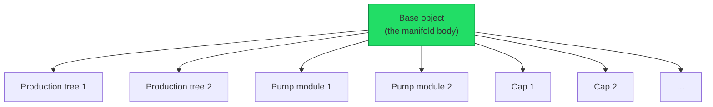
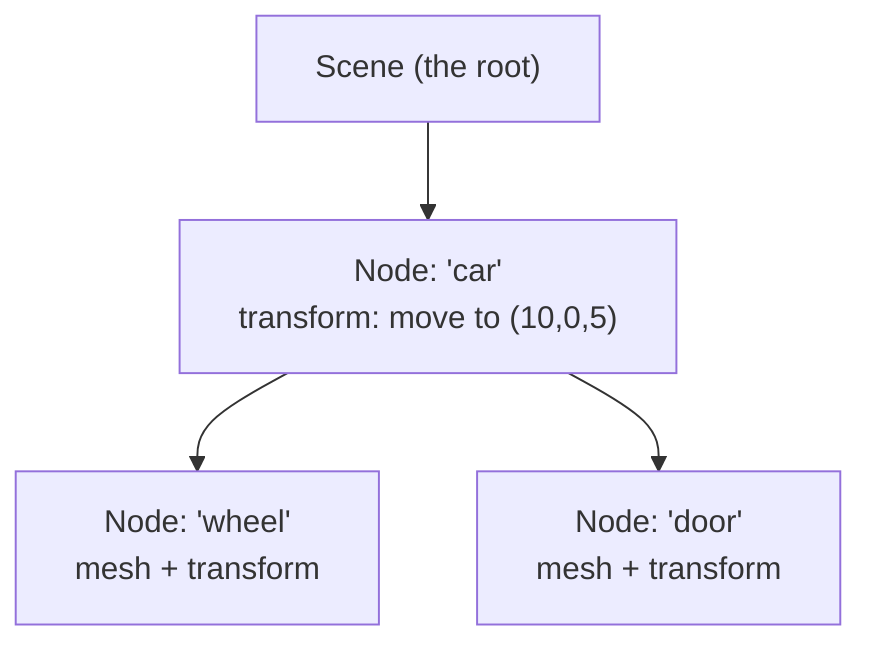
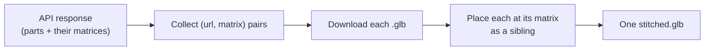
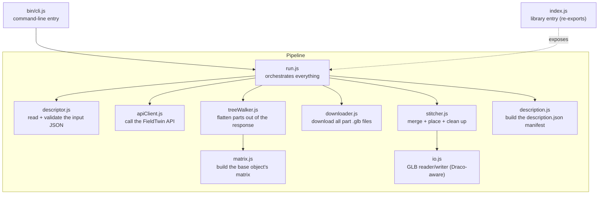
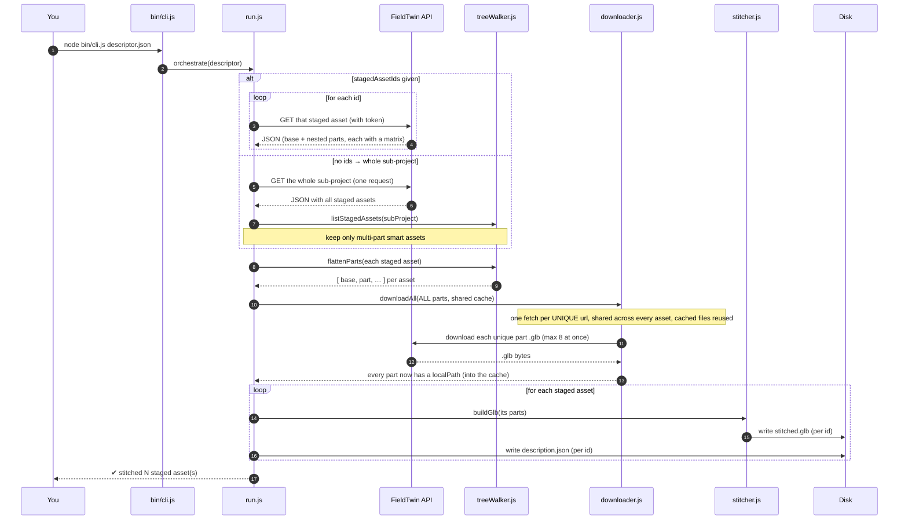
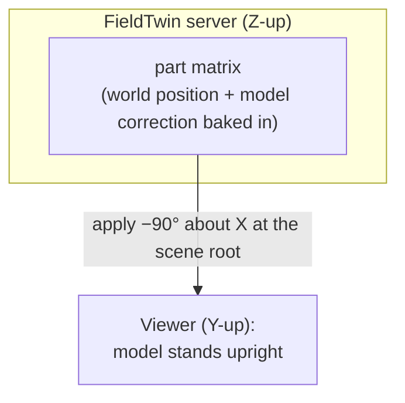
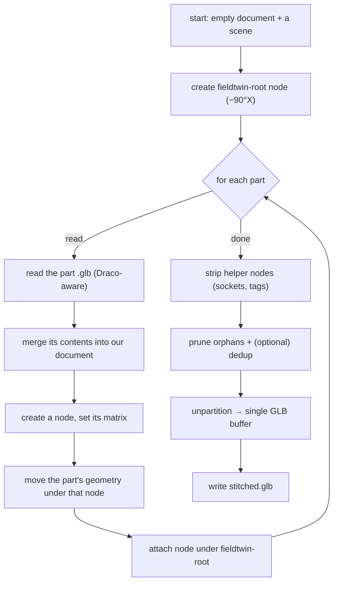

# Smart Asset Stitcher — The Complete Guide

> A from-scratch walkthrough of the whole application for someone new to the 3D world.
>
> If you want the *terse* engineering notes instead
> [ARCHITECTURE.md](./ARCHITECTURE.md). This guide is the friendly, long-form version.

---

## Table of contents

1. [What problem does this solve?](#1-what-problem-does-this-solve)
2. [A 10-minute crash course in 3D](#2-a-10-minute-crash-course-in-3d)
3. [The one big idea that makes this tool simple](#3-the-one-big-idea-that-makes-this-tool-simple)
4. [The map: files and what each does](#4-the-map-files-and-what-each-does)
5. [The pipeline, step by step](#5-the-pipeline-step-by-step)
6. [Coordinate systems — the trickiest part, explained slowly](#6-coordinate-systems--the-trickiest-part-explained-slowly)
7. [Two finishing touches: the frame node and helper stripping](#7-two-finishing-touches-the-frame-node-and-helper-stripping)
8. [The output files explained](#8-the-output-files-explained)
9. [How to run it](#9-how-to-run-it)
10. [FAQ](#10-faq)
11. [How to modify or extend it](#11-how-to-modify-or-extend-it)
12. [Troubleshooting](#12-troubleshooting)
13. [Glossary](#13-glossary)

---

## 1. What problem does this solve?

**FieldTwin** is a platform for designing subsea oil-and-gas field layouts in 3D. Inside
it, engineers place **assets** — 3D models of real equipment (manifolds, wellheads,
production trees, etc.).

A **smart asset** is not one model. It is a **base object** with **docking sockets**, onto
which other parts snap, and those parts have their own sockets, and so on — like LEGO. One
"manifold" you see in the app might actually be 9 separate 3D files locked together in a
specific arrangement.



**The problem:** when you want to hand this asset to someone outside FieldTwin — a client,
a different 3D viewer, a game engine, a VR walkthrough — you can't easily give them "9 files
plus instructions on how to arrange them." You want **one self-contained file** that already
has everything in the right place.

**This tool does exactly that:** you point it at some smart assets, it talks to the
FieldTwin API, downloads all the individual part models, places each one correctly, and
writes out a single `stitched.glb` per asset (plus a human-readable `description.json`).

You can point it at assets two ways:

- **Specific** — list the staged-asset IDs you want.
- **Whole sub-project** — give no IDs, and it pulls *every* staged asset in the sub-project
  in one request and stitches each multi-part smart asset it finds.

Either way it is careful about downloads: each part model is fetched only **once**, even if
ten different smart assets all use the same part — they share one cached file. (The earlier
version re-downloaded the parts separately for every staged asset; see §5.)

"Stitching" = sewing the separate parts into one combined model.

---

## 2. A 10-minute crash course in 3D

You don't need to be a 3D expert to maintain this tool, but you need a handful of concepts.
Read this once and the rest of the guide will click.

### 2.1 What a 3D model is made of

- **Vertex** — a point in space, like `(1.0, 2.0, 3.0)`.
- **Triangle** — three vertices. Every 3D surface is ultimately a pile of triangles.
- **Mesh** — a bag of triangles that form one shape (e.g. "the pump housing").
- **Material / texture** — the color/shininess/image painted onto the mesh's surface.

A single model file bundles meshes + materials + textures together.

### 2.2 GLTF and GLB — the file format

**glTF** ("GL Transmission Format") is the modern standard for shipping 3D models — people
call it *"the JPEG of 3D."* It comes in two flavors:

| Flavor | What it is | Analogy |
| --- | --- | --- |
| `.gltf` | A JSON text file (human-readable), often with separate data/image files next to it | A web page + its images |
| `.glb`  | The **same data packed into one binary file** | A zipped-up, single-file version |

Our tool reads `.glb` part files and writes one `.glb` output. (The reference file the
client gave us, `real-coord.gltf`, happens to be the text flavor — same format, just
readable.)

### 2.3 The scene graph: a tree of "nodes"

A glTF file organizes everything as a **tree**. Each item in the tree is a **node**. A node
can:

- hold a **mesh** (actual geometry), and/or
- hold a **transform** (where/how it's positioned), and/or
- have **child nodes**.



**Key rule of trees:** a child's final position is its parent's transform **combined with**
its own. If you move the `car` node, the `wheel` and `door` move with it. This "inheritance"
is the single most important idea for understanding this tool — and the source of the one
real subtlety (more in §6).

### 2.4 Transforms and matrices

A **transform** answers: *where is this thing, which way is it facing, how big is it?* It
combines three operations:

- **Translation** — move (x, y, z)
- **Rotation** — spin around an axis
- **Scale** — resize

All three can be packed into a single **4×4 matrix** — a grid of 16 numbers. Multiplying a
point by this matrix applies the move + rotation + scale in one shot. Combining two
transforms = multiplying their matrices.

You do **not** need to do matrix math by hand to maintain this tool. You only need to know:

- A transform is **16 numbers**.
- The order they're stored in matters (see "column-major" below).
- "Apply matrix A then matrix B" = a specific multiplication, and order is **not**
  interchangeable (rotating-then-moving ≠ moving-then-rotating).

#### Column-major (a 10-second note)

Those 16 numbers can be written down in two orders: row-by-row ("row-major") or
column-by-column ("column-major"). glTF and the math library we use (gltf-transform) both
use **column-major**, and so does FieldTwin's API. Because everyone agrees, **we copy the
numbers across as-is — no flipping, no transposing.** The last four numbers (positions
12, 13, 14) are the translation (the x/y/z position). That fact gets used a lot.

```
index:  0  1  2  3   4  5  6  7   8  9 10 11   12 13 14 15
        └─ basis ─┘   └─ basis ─┘  └─ basis ─┘   └ position ┘
        (rotation + scale live in the 12 basis numbers)        ↑ x,y,z
```

### 2.5 Coordinate systems (axes)

Different software disagrees on **which way is up**:

- Most 3D viewers / glTF / three.js: **Y is up** ("Y-up").
- Many engineering/GIS systems (including FieldTwin's server data): **Z is up** ("Z-up"),
  with X = East, Y = North.

If you load Z-up data into a Y-up viewer without converting, the model appears **lying on
its back, rotated 90°**. Converting between the two is a single fixed rotation. This is
exactly the "−90° about X" step you'll see later (§7). It is not a bug or a hack — it's the
standard handshake between these two worlds.

### 2.6 Draco compression

Real 3D models are big. **Draco** is a compression scheme that shrinks the geometry inside
a `.glb`. A file can be Draco-compressed, and a reader needs a **Draco decoder** to open it.
FieldTwin's part files are Draco-compressed, so our tool registers a decoder (see
[src/io.js](../src/io.js)). If we didn't, reading the files would fail with *"Missing
required extension KHR_draco_mesh_compression."*

---

## 3. The one big idea that makes this tool simple

Here is the insight the whole design rests on. **Read this twice.**

> **FieldTwin's API has already done all the hard positioning math for us.**

When you ask the API for a smart asset, every placeable part comes with a field called
`transformMatrix` — those 16 numbers — that is the part's **final, absolute, world
position**, with all the LEGO-snapping ("docking") math already baked in.

So this tool does **not** need to understand sockets, docking, or geometry. It only:

1. collects pairs of `(model file URL, transformMatrix)`, and
2. drops each model into the scene at its matrix.

That's it. Three rules follow from "the matrix is already final":

1. **Apply the matrix directly.** No flipping, no extra rotation. The number layout already
   matches what our 3D library expects.
2. **Parts are siblings, never nested.** Because each matrix is already a *world* position
   (not relative to a parent), if we nested parts inside each other their positions would
   get applied twice and everything would fly apart.
3. **Use the matrix, not the separate rotation numbers.** The API also reports human-readable
   `xRotation/yRotation/zRotation` angles, but those have been adjusted for display and would
   render wrong. The matrix is the source of truth.



(There is **one** thing the API does *not* give a matrix for — the base object. We handle
that specially: `matrix.js` synthesizes its matrix from the staged-asset `initialState`, and
`flattenParts` emits it first as `partId: "base"`.)

---

## 4. The map: files and what each does

The project is plain JavaScript (no build step, no TypeScript source). Each file is a small,
focused piece. Here is the whole thing at a glance:



| File | One-line job | "Pure"? |
| --- | --- | --- |
| [bin/cli.js](../bin/cli.js) | Parse command-line args, call `orchestrate`, print results | no (I/O) |
| [index.js](../index.js) | Public library API — re-exports the functions below | n/a |
| [index.d.ts](../index.d.ts) | Hand-written TypeScript types for library consumers | n/a |
| [src/descriptor.js](../src/descriptor.js) | Load + validate the descriptor JSON you feed in (`stagedAssetIds` optional) | pure-ish |
| [src/apiClient.js](../src/apiClient.js) | Build the API URLs, fetch one staged asset **or** the whole sub-project, handle HTTP errors | no (network) |
| [src/treeWalker.js](../src/treeWalker.js) | Walk the API's nested tree → a flat list of parts (+ the base); list a sub-project's staged assets | **pure** |
| [src/matrix.js](../src/matrix.js) | Synthesize the base object's transform matrix | **pure** |
| [src/downloader.js](../src/downloader.js) | Download every **unique** part `.glb` once into a shared cache (concurrency-limited, retries, reuses cached files) | no (network) |
| [src/stitcher.js](../src/stitcher.js) | Merge parts into one document, place them, strip helpers, write GLB | no (file I/O) |
| [src/io.js](../src/io.js) | Create a GLB reader/writer that understands Draco compression | no |
| [src/description.js](../src/description.js) | Build the `description.json` manifest object | **pure** |
| [src/run.js](../src/run.js) | Wire it together: collect staged assets → flatten all → one global download → stitch each | no |

> **"Pure" means** the function only transforms its inputs into outputs with no side effects
> (no network, no disk). Pure functions are the easiest to test and the safest to change —
> note how much of the tricky logic (`treeWalker`, `matrix`, `description`) is pure.

---

## 5. The pipeline, step by step

Here's what happens when you run the tool, end to end.



In words:

1. **You provide a descriptor** — a small JSON file with the API address, a token, and the
   project/sub-project/stream IDs. Optionally the staged asset IDs you want; leave them out
   to take the whole sub-project. (§9 shows the shape.)
2. **Validate it** ([descriptor.js](../src/descriptor.js)) — fail fast with a clear message
   if a field is missing.
3. **Collect the staged assets** ([run.js](../src/run.js) → [apiClient.js](../src/apiClient.js)):
   either fetch each listed ID, or fetch the **whole sub-project in one request** and keep
   only its multi-part smart assets ([treeWalker.js](../src/treeWalker.js)'s `listStagedAssets`).
4. **Flatten** each one ([treeWalker.js](../src/treeWalker.js)): the API returns a deeply
   nested tree; we walk it and pull out a flat list of placeable parts — plus we synthesize
   the base object and put it first.
5. **Download once, globally** ([downloader.js](../src/downloader.js)): all the parts from
   all the staged assets go through a *single* download pass, up to 8 at a time, retrying on
   failure. Each **unique URL** is fetched only once (a part shared by many assets → one
   file) into the shared `<output>/assets` cache, and a file already in the cache is reused
   with no network call.
6. **Stitch each asset** ([stitcher.js](../src/stitcher.js)): merge its part files into one
   document, place each at its matrix under a shared "frame" node, strip editor-only helper
   bits, consolidate into one buffer, and write `<id>/stitched.glb`.
7. **Describe** ([description.js](../src/description.js)): write `<id>/description.json`, a
   human-readable manifest of what went where.

> **Why this shape?** The earlier version did fetch-download-stitch *per staged asset*, so a
> part used by 100 assets was downloaded 100 times. Splitting it into "collect everything →
> download the unique set once → stitch each" is the whole efficiency win.

### Module deep-dives

**descriptor.js** — `loadDescriptor(path)` reads the file and `validateDescriptor(obj)`
checks the required fields are present and non-empty. Throws actionable errors. Pure
validation, easy to extend (add a field check here).

**apiClient.js** — `stagedAssetUrl(...)` and `subProjectUrl(...)` build the two endpoint
URLs. They're tolerant: if your `api` value already ends in `/API/v1.10/`, they won't double
it up. `fetchStagedAsset(...)` fetches one staged asset; `fetchSubProject(...)` fetches the
whole sub-project (its `stagedAssets` is a map keyed by id, enriched the same way). Both do
the HTTP GET with the `token` header and turn common failures into clear messages (401/403 =
bad/expired token; 404 = wrong IDs).

**treeWalker.js** — the heart of "understanding" the response. The API gives a recursive
structure: `metaData[]`, where each entry can have `subValue[]` children, nested up to ~7
deep. A node is a **placeable part** if it has both a model URL and a 16-number matrix. The
deepest leaf is empty (no model) and is skipped + counted. `flattenParts` produces
`{ parts, skippedNodes }`. It also calls into `matrix.js` to prepend the base object.
`listStagedAssets(subProject)` turns the sub-project's keyed `stagedAssets` map into a
sorted array, ready to flatten one by one.

**matrix.js** — builds the one matrix the API doesn't provide (the base object's): the API
gives a `transformMatrix` for every docked part but **not** for the base, so `matrix.js`
synthesizes it from the staged-asset `initialState` and `flattenParts` emits it first.

**downloader.js** — a hand-rolled "download pool": it keeps at most 8 downloads in flight
(polite to the server) and retries each up to 3 times with backoff. It is given *all* the
parts across *all* the staged assets at once, and downloads the **set of unique URLs** —
so a part shared by many assets is fetched a single time. Files are stored
**content-addressed**: the filename is a short hash of the URL (`cacheFileName`), so the same
URL always maps to the same file, and a file already present (from another asset this run, or
a previous run) is reused without re-downloading. Afterwards every part's `localPath` points
at its file in the shared `<output>/assets` cache.

**stitcher.js** — covered in §7. This is where the parts become one model.

**io.js** — creates the gltf-transform `NodeIO` (the read/write engine) with the Draco
decoder/encoder registered, so compressed part files can be read.

**description.js** — produces the `description.json` object (see §8). Pure.

**run.js** — the wiring, in three clear phases. `orchestrate`: **collect** the staged assets
(listed IDs, or the whole sub-project filtered to smart assets) → flatten them all →
**download** every unique part once into the shared cache → **stitch** each asset.
`stitchStagedAsset` is the single-asset path (fetch → flatten → download → stitch) kept for
direct library use; it writes into the same shared cache.

---

## 6. Coordinate systems — the trickiest part, explained slowly

If a client ever asks *"why was the model sideways / how do you know it's in the right
place,"* this is the section that matters. Take it slowly.

### 6.1 Three different "spaces"

There are three coordinate worlds in play:

1. **The raw model's own space.** When an artist exports a single part `.glb`, the geometry
   sits around its own little origin. FieldTwin models need a **+90° rotation about X** to
   stand up correctly — this is called the **model correction**. (Think: the raw models were
   authored lying down; FieldTwin tips them upright.)

2. **FieldTwin world space (Z-up).** The big real-world coordinates — e.g. X ≈ 528,916,
   Y ≈ 6,185,031 (these are UTM map coordinates, meters), Z = depth. Here **Z is up.**

3. **Viewer space (Y-up).** What a normal glTF viewer expects, where **Y is up.**

### 6.2 What the API's matrix already contains

The `transformMatrix` for each part is **FieldTwin world space** and **already includes the
+90° model correction**. So when we apply it, the part is correctly oriented and correctly
positioned *in FieldTwin's Z-up world*. Good.

This is why, numerically, each part's position (matrix slots 12/13/14) equals the part's
reported x/y/z — and why our first version passed every *numeric* check.

### 6.3 The catch: Z-up vs Y-up

Our first output was numerically perfect but, in a normal viewer, **tipped 90° on its back**
— because the data is Z-up and viewers are Y-up. FieldTwin's own exporter solves this by
putting a single **−90° about X** rotation at the very top of the file, which rotates the
whole assembly from Z-up into Y-up.



So our final output mirrors that: **one `fieldtwin-root` node with a −90°X matrix, with all
parts as its children.** We discovered the exact rotation by comparing against the client's
reference export (`real-coord.gltf`) — every model mesh lined up to within 0.00003 once we
added it.

> **Mental model:** the part matrices put everything in the right place in FieldTwin's world.
> The one root rotation then turns that whole world the right way up for viewers. We never
> touch the individual part matrices to do this — it's one rotation applied once, at the top.

### 6.4 Why we don't "just nest" parts like FieldTwin's export does

FieldTwin's reference file nests parts under a "StagedAsset" node with *relative* offsets.
We use *absolute* matrices as flat siblings under the frame root. **Both produce the exact
same final positions** — they're two ways of writing the same thing. We use siblings because
the API hands us absolute matrices, and nesting absolute matrices would apply transforms
twice. (This is rule 2 from §3.)

---

## 7. Two finishing touches: the frame node and helper stripping

These two steps in [stitcher.js](../src/stitcher.js) are what made our output match the
client's reference file exactly.

### 7.1 The frame node (`fieldtwin-root`)

As explained in §6.3: all parts are added as children of a single node carrying the
**−90°X** matrix, converting Z-up FieldTwin data into Y-up viewer data. One line of intent:

```js
const frameRoot = doc.createNode('fieldtwin-root')
frameRoot.setMatrix(FIELDTWIN_TO_GLTF)   // a fixed −90°-about-X matrix
scene.addChild(frameRoot)
// … each part node is added with frameRoot.addChild(node)
```

### 7.2 Helper stripping

The individual part `.glb` files contain **editor-only helper geometry** that FieldTwin
shows while you're designing but does **not** include in its own exports:

- `docking_male_NNN`, `docking_female_NNN` — little markers showing where sockets connect.
- `tag_NNN` — label markers.

To match a clean export, `buildGlb` removes any node whose name matches
`docking_male` / `docking_female` / `tag`, then runs `prune()` to clean up the leftover
meshes. You can keep them with the `keepHelpers: true` option if a client ever wants the
sockets visible.

### 7.3 The full stitch, visualized



> **Why "unpartition"?** Each part file brings its own data buffer. The `.glb` format allows
> only one buffer per file, so we merge them all into one at the end. Without this you get
> *"GLB must have 0–1 buffers."*

---

## 8. The output files explained

The downloaded part files live **once** in a shared cache; each stitched staged asset gets
its own small folder:

```
<output>/
├── assets/                       ← shared part cache (one file per unique URL, reused
│   ├── 8f3a1c9b2e7d4a06.glb         across every asset and across re-runs)
│   ├── a1b2c3d4e5f60718.glb
│   └── …
├── <stagedAssetId-1>/
│   ├── stitched.glb              ← the final combined model (give this to clients)
│   └── description.json          ← a human-readable manifest of what's inside
└── <stagedAssetId-2>/
    ├── stitched.glb
    └── description.json
```

> **Where did `parts/` go?** Earlier versions copied each asset's parts into its own
> `parts/` subfolder. Now the parts are deduplicated into the single `assets/` cache — a part
> used by several assets is stored once. `description.json` still names the exact cache file
> for each part (`localFile`), so you can always trace a part back to its `.glb`. The cache
> filename is a hash of the source URL.

### description.json — your "receipt"

This is the file you'll read to answer "what's in here?" questions. It records:

- `stagedAssetId`, `stagedAssetName`, and the project/sub-project/stream IDs (provenance).
- `generatedAt` — when it was made.
- `matrixConvention: "column-major"` and `correctionApplied: "baked-in-by-api"` — notes so
  downstream consumers don't re-apply the rotation correction by mistake.
- `baseAsset` — the base object's id, name, model URL, and docking sockets.
- `skippedNodes` — how many empty tree nodes were skipped (normal; the deepest leaves).
- `parts[]` — one entry per placed part:
  - `partId` (e.g. `"base"`, `"003"`), `isBase` (true for the base object),
  - `docking` (which socket), `model3dUrl`, `localFile` (the file in the shared `assets/` cache),
  - `transformMatrix` (the 16 numbers used to place it).

---

## 9. How to run it

### As a command-line tool

```bash
# 1. install once
npm install

# 2. create a descriptor.json (see shape below) — keep real ones OUT of git (they hold tokens)

# 3. run
node bin/cli.js ./descriptor.json
#   add --optimize to shrink the output (dedup + prune)
```

**Descriptor shape:**

```json
{
  "api": "https://your-fieldtwin-host/",
  "token": "<api-token-or-jwt>",
  "projectId": "...",
  "subProjectId": "...",
  "streamId": "...",
  "stagedAssetIds": ["-Ou7JZqf354wxP2XTZT4"],
  "output": "./out",
  "optimize": false,
  "keepHelpers": false
}
```

| Field | Meaning |
| --- | --- |
| `api` | FieldTwin API base URL. May or may not include `/API/v1.10/` — both work. |
| `token` | Auth token, sent as the `token` header. **Secret — never commit.** |
| `projectId` / `subProjectId` / `streamId` | Which project/branch the assets live in. |
| `stagedAssetIds` | **Optional.** List of smart-asset IDs to stitch (one output folder each). **Omit it (or use `[]`) to stitch the whole sub-project** — every multi-part smart asset in it. |
| `output` | Where to write results (parts cache + one folder per stitched asset). |
| `optimize` | `true` = run dedup + prune to reduce file size. |
| `keepHelpers` | `true` = keep docking-socket/tag markers (default strips them). |

**Whole-sub-project run** — same command, just drop `stagedAssetIds`:

```json
{
  "api": "https://your-fieldtwin-host/",
  "token": "<api-token-or-jwt>",
  "projectId": "...",
  "subProjectId": "...",
  "streamId": "...",
  "output": "./out"
}
```

This fetches the sub-project once and stitches every smart asset it contains, downloading
each shared part only once.

> **Security note:** descriptors carry a live token. The repo's `.gitignore` keeps
> `descriptor.json` and `descriptor.*.json` out of git, committing only the placeholder
> `descriptor.example.json`. Tokens in signed download URLs also **expire** — a 403 during
> download means "regenerate the descriptor."

### As a library

```js
import { orchestrate } from 'smart-asset-stitcher'

// Specific staged assets:
const results = await orchestrate({
  api: 'https://host/', token: '…',
  projectId: '…', subProjectId: '…', streamId: '…',
  stagedAssetIds: ['…'], output: './out',
})

// Whole sub-project — same call, just omit stagedAssetIds:
const all = await orchestrate({
  api: 'https://host/', token: '…',
  projectId: '…', subProjectId: '…', streamId: '…',
  output: './out',
})
```

Individual pieces are also exported (`fetchStagedAsset`, `fetchSubProject`,
`listStagedAssets`, `flattenParts`, `downloadAll`, `buildGlb`, `buildDescription`, plus the
URL builders `stagedAssetUrl` / `subProjectUrl`) if you want to assemble your own flow — see
[index.js](../index.js).

---

## 10. FAQ

**Q: What does this actually produce?**
A single self-contained `.glb` 3D file of a FieldTwin smart asset, with every part already
in its correct position — openable in any standard glTF viewer.

**Q: Is the positioning accurate?**
Yes. The positions come straight from FieldTwin's API (it does the docking math). We verified
our output against FieldTwin's own export of the same asset and every part matched to within
0.00003 meters.

**Q: Why does the model use such huge coordinates (like 528,916)?**
Those are real-world map coordinates (UTM, in meters) — the asset's actual location on Earth.
That's intentional ("real-coord"). The model is also rotated to be upright (Y-up) for viewers.

**Q: Does it look the same as in FieldTwin?**
Yes — same parts, same arrangement, same orientation. We strip only the editor-only helper
markers (sockets/tags) that FieldTwin itself also leaves out of exports.

**Q: Can I get the docking sockets included?**
Yes — set `keepHelpers: true`.

**Q: Can it do several assets at once?**
Yes — list multiple IDs in `stagedAssetIds`; each gets its own output folder. Or omit
`stagedAssetIds` entirely to stitch the **whole sub-project** in one go.

**Q: What's the difference between giving IDs and doing the whole sub-project?**
With IDs it fetches exactly those staged assets. Without IDs it fetches the sub-project in a
single request and stitches every multi-part smart asset in it (skipping plain single-model
ones). Both share the same efficient backend.

**Q: If many assets reuse the same part, is it downloaded repeatedly?**
No. All parts across all assets go through one download pass, and each unique part URL is
fetched only once into a shared cache (and reused on re-runs). This is the main performance
improvement over the original per-asset approach.

**Q: What 3D formats does it support?**
Output is `.glb` (binary glTF), the industry-standard interchange format. Input part files
are Draco-compressed `.glb` from FieldTwin, handled automatically.

**Q: Is it tied to the FieldTwin monorepo / can it run standalone?**
It's a standalone, publishable npm package with only a couple of 3D-library dependencies. It
talks to FieldTwin only over the public API.

---

## 11. How to modify or extend it

A quick "if you want to change X, edit Y" table, then a couple of worked examples.

| You want to… | Go to… |
| --- | --- |
| Add/validate a new descriptor field | [src/descriptor.js](../src/descriptor.js) |
| Change the API version or URL shape | [src/apiClient.js](../src/apiClient.js) (`stagedAssetUrl` / `subProjectUrl`) |
| Change which staged assets are selected (ids vs sub-project, smart-asset filter) | [src/run.js](../src/run.js) (`collectEntries` / `isSmartAsset`) |
| Change which tree nodes count as "parts" | [src/treeWalker.js](../src/treeWalker.js) (`isPlaceablePart`) |
| Change how the base object is positioned | [src/matrix.js](../src/matrix.js) |
| Change download concurrency / retries / cache naming | [src/downloader.js](../src/downloader.js) (constants + `cacheFileName`) |
| Change the coordinate frame / orientation | [src/stitcher.js](../src/stitcher.js) (`FIELDTWIN_TO_GLTF`) |
| Change which helper meshes get stripped | [src/stitcher.js](../src/stitcher.js) (`HELPER_NODE` regex) |
| Add support for Meshopt-compressed inputs | [src/io.js](../src/io.js) (register another extension) |
| Change what's in description.json | [src/description.js](../src/description.js) |
| Add a CLI flag | [bin/cli.js](../bin/cli.js) (`parseArgs`) |

### Worked example A — "keep the docking sockets in the output"

Already supported: add `"keepHelpers": true` to the descriptor. No code change needed.

### Worked example B — "the input models are Meshopt-compressed, not Draco"

Edit [src/io.js](../src/io.js): import `EXTMeshoptCompression` from
`@gltf-transform/extensions` and the `meshoptimizer` decoder, and register them on the
`NodeIO` the same way Draco is registered. Add `meshoptimizer` to `package.json`.

### Worked example C — "I want a different output orientation (e.g. keep it Z-up)"

The orientation is the single matrix `FIELDTWIN_TO_GLTF` in
[src/stitcher.js](../src/stitcher.js). Set it to the identity matrix
`[1,0,0,0, 0,1,0,0, 0,0,1,0, 0,0,0,1]` to keep raw FieldTwin Z-up coordinates, or to a
different rotation as needed.

### Before you ship a change

```bash
npm test                 # all unit tests should stay green
node bin/cli.js ./descriptor.json   # run against a real asset
# then open stitched.glb in a viewer to confirm visually
```

The tests cover the pure logic (tree flattening, the base matrix, description building) and
the stitcher's structure (frame node, helper stripping). If you change the matrix recipe or
the frame, expect to update [test/matrix.test.js](../test/matrix.test.js) /
[test/stitcher.test.js](../test/stitcher.test.js).

---

## 12. Troubleshooting

| Symptom | Likely cause | Fix |
| --- | --- | --- |
| `Authorization failed (401/403)` when fetching | Bad or expired token | Regenerate the descriptor / token |
| `403 Forbidden` during **download** | Signed model URL expired | Regenerate the descriptor (URLs are time-limited) |
| `not found (404)` | Wrong project/sub-project/stream/asset IDs | Double-check the IDs |
| `Missing required extension "KHR_draco_mesh_compression"` | Draco decoder not registered (shouldn't happen now) | Ensure [src/io.js](../src/io.js)'s `createIO` is used |
| `GLB must have 0–1 buffers` | The single-buffer step was skipped | Ensure `unpartition()` runs in [stitcher.js](../src/stitcher.js) |
| Model appears rotated 90° / lying down | Frame conversion missing or wrong | Check `FIELDTWIN_TO_GLTF` in [stitcher.js](../src/stitcher.js) |
| Base object missing, parts float | Base not collected | Ensure `flattenParts` emits the base (`partId: "base"`) |
| Extra socket/tag clutter in output | Helpers not stripped | Default strips them; check `HELPER_NODE` / `keepHelpers` |
| `produced no placeable parts` | A listed ID isn't a smart asset, or response shape changed | Verify it's a multi-part smart asset |
| `No smart assets to stitch` (whole-sub-project mode) | The sub-project has no multi-part smart assets | Use `stagedAssetIds` to target specific assets, or check the sub-project |

---

## 13. Glossary

- **Asset** — a 3D model of a piece of equipment in FieldTwin.
- **Smart asset** — a base object plus docked parts (and their docked parts…), forming one
  composite object.
- **Staged asset** — a specific *instance* of an asset placed in a project's scene; what we
  fetch by ID.
- **Base object** — the root model a smart asset's parts dock onto (`stagedAsset.asset`).
- **Part** — any individual model in the smart asset (the base + each docked piece).
- **Docking / sockets** — the LEGO-like connection system. "Male"/"female" sockets snap
  together. The API resolves these into final positions for us.
- **glTF / GLB** — the 3D interchange file format (text / binary). What we read and write.
- **Node** — an item in a glTF scene tree; can hold a mesh and/or a transform and/or
  children.
- **Mesh** — actual triangle geometry.
- **Transform / matrix** — where/orientation/size of a node, as 16 numbers (4×4 matrix).
- **Column-major** — the order the 16 matrix numbers are stored; everyone here agrees, so we
  copy them straight across.
- **Model correction (+90°X)** — the fixed rotation that stands FieldTwin's raw models
  upright; already baked into the API's part matrices.
- **Z-up / Y-up** — which axis points "up." FieldTwin server data is Z-up; viewers are Y-up;
  the `fieldtwin-root` node converts between them.
- **Draco** — geometry compression used inside the part `.glb` files.
- **Descriptor** — the input JSON you give the tool (API address, token, IDs, output path).
- **Stitching** — combining the separate part models into one file.
- **Pure function** — a function with no side effects; the safest kind to change.

---

*Questions this guide didn't answer? The terse engineering reference is
[CLAUDE.md](../CLAUDE.md), and the mathematical proof of the matrix handling is in
[ARCHITECTURE.md](./ARCHITECTURE.md).*
